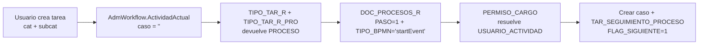
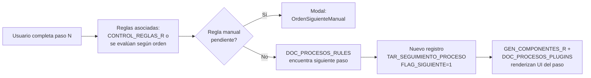

# AdmWorkflow (ORIGEN) -> WorkflowEngine (DESTINO)

> Esta ficha es el **plano del ETL/port** del motor de ejecucion. Primero fija el
> contrato del componente DESTINO (`WorkflowEngine` en .NET 10) y luego conserva
> el analisis completo de la clase ORIGEN `AdmWorkflow` (VB, WebForms) como
> reglas de negocio a preservar. Enlaza con [[Visión y entorno]] (seccion 7) y
> [[00 - Prototipo Final ECOREX]].

## D0. WorkflowEngine — contrato destino

`WorkflowEngine` es el servicio de aplicacion (Clean Architecture, capa
`Application`) que porta a .NET 10 lo que `AdmWorkflow` hace hoy con SQL
concatenado. Contrato conceptual:

```csharp
public interface IWorkflowEngine
{
    // Descubrimiento del paso actual (ActividadActual)
    Task<WorkflowStep?> GetCurrentStepAsync(Guid tenantId, Guid caseId, string userId, CancellationToken ct);

    // Siembra del caso al crearlo (GuardarTablaSeguimiento)
    Task SeedCaseAsync(Guid tenantId, Guid caseId, string category, string subcategory, CancellationToken ct);

    // Avance del caso (SiguienteEstado) — transaccional, con tope de iteraciones
    Task<AdvanceResult> AdvanceAsync(Guid tenantId, Guid caseId, bool runAutonomousRules, CancellationToken ct);

    // Componentes (formularios/plugins) a renderizar en un paso (ConsultaPlugin)
    Task<IReadOnlyList<NodeComponent>> GetNodeComponentsAsync(Guid tenantId, string nodeId, Guid caseId, CancellationToken ct);

    // Validacion al guardar el diagrama (ValidarCambiosFlujo) — ahora versiona
    Task ValidateDefinitionChangesAsync(Guid tenantId, Guid definitionId, CancellationToken ct);
}
```

Mapeo de metodos ORIGEN -> DESTINO:

| Origen (`AdmWorkflow`) | Destino (`WorkflowEngine`) | Nota de port |
|---|---|---|
| `ActividadActual()` | `GetCurrentStepAsync` | SELECT concatenado -> LINQ/EF Core; `fn_ConsultaCargo` -> servicio de cargos |
| `PermisoActividadInicial(Usuario)` | policy `CanStartWorkflow` | ACL por nodo -> policy .NET |
| `ConsultaPlugin(...)` | `GetNodeComponentsAsync` | union de componentes + forms; FK real a `dynamic_form` |
| `SiguienteEstado(...)` | `AdvanceAsync` | while-loop en transaccion + eventos de dominio |
| `GuardarTablaSeguimiento(...)` | `SeedCaseAsync` | INSERT masivo -> insert transaccional, `TenantId` |
| `ValidarCambiosFlujo(...)` | `ValidateDefinitionChangesAsync` | ahora VERSIONA el flujo (no solo repara) |

## D1. Modelo de estado destino

El estado de ejecucion migra de `TAR_SEGUIMIENTO_PROCESO` a
`workflow_step_history` con `Guid` v7 (PK ordenable en el tiempo), `TenantId`
obligatorio, y semantica append-only preservada (cada iteracion de ciclo deja
fila — auditoria completa). Correspondencias criticas:

- `FLAG_SIGUIENTE=1` -> columna `is_current` / estado `Pending` del paso activo.
- `ACTIVIDAD_CICLO` -> `cycle_index` (loops BPMN, ver [[Ejecucion - SiguienteEstado y Reinicios]]).
- `ENCARGADO` / `USUARIO_EJECUTOR` -> `assigned_to` / `executed_by` (Guid usuario).
- `FLAG_INA` -> `is_inactive` (cambios de ACL al vuelo).

## D2. Correcciones al portar

- **7 parametros posicionales** del constructor `AdmWorkflow` -> objeto
  `WorkflowContext { TenantId, CaseId, Category, SubCategory, AssignedTo, ActivityId, CycleId }`
  (inmutable, validado).
- **SQL concatenado** en cada metodo -> EF Core parametrizado (corrige el error
  de inyeccion #1 del origen).
- **`Session("Empresa")` en cada query** -> `ITenantProvider.CurrentTenantId`
  resuelto por middleware, aplicado por `HasQueryFilter` + RLS.
- **UDF `fn_ConsultaCargo`** (opaca a .NET) -> `ICargoResolver` con query EF Core
  equivalente (o vista SQL portada), testeable en ambos motores.
- **Reglas manuales pendientes** (`HayReglasManualesPendientes`,
  `OrdenSiguienteManual`) -> resultado tipado `AdvanceResult.PendingManualRule`
  que el frontend Blazor consume para abrir el modal (hoy: postback + literal).

## D3. Ejecucion de reglas por nodo

Donde `AdmWorkflow` dispara reglas autonomas en cascada, `WorkflowEngine` invoca
`RulesEngine` (port de `cl_gestion_reglas`, ver
[[Reglas - Quien invoca realmente (cierre)]]). El origen declara 3 modos
(`mDATA`/`Execute`/`Ensamblado`) pero solo **Ensamblado** esta implementado
(ver [[Reglas - Catalogo real y verbos Ensamblado]]); el destino formaliza los
verbos en un **registro tipado** (`IReadOnlyDictionary<string, IRuleVerb>`) en
vez de `Activator.CreateInstance` sobre un nombre de clase que viene del XML
(vector RCE del origen).

---

> A partir de aqui, el ANALISIS DEL ORIGEN (clase legacy `AdmWorkflow.vb`) como
> referencia de migracion. Es el detalle de comportamiento que `WorkflowEngine`
> debe reproducir.

# AdmWorkflow [ORIGEN] — Motor de ejecución del flujo BPMN (legacy VB)

> [!success] Qué es
> La **clase de negocio** que ejecuta los flujos diseñados en el módulo **Flujos del Proceso (000291)**. No es un control visual — es la "máquina" que mira `DOC_PROCESOS_R` (los nodos del BPMN), `DOC_PROCESOS_RULES` (las transiciones), `DOC_PROCESOS_PLUGINS` y `GEN_COMPONENTES_R` (los componentes a renderizar en cada paso), y `TAR_SEGUIMIENTO_PROCESO` (estado actual de cada caso en curso), y decide qué pintar/permitir al usuario.

---

## 1. Ubicación y consumo

| Donde | Cómo |
|---|---|
| **Vive en** | `Bootstrap\Formularios\Modulos\Tareas\workflow\AdmWorkflow.vb` |
| **Lo consume `NEWFRONT_doc_procesos.aspx.vb`** | `Dim workFlow As New AdmWorkflow(Empresa, "", "", "", Usuario, "", "")` → `workFlow.ValidarCambiosFlujo(cmbcodigo.SelectedValue, Empresa)` cada vez que se guarda un diagrama |
| **Probablemente también consumido por** | Las páginas que ejecutan tareas (`NEWFRONT_admtareas`, `NEWFRONT_tar_tareas`, `NEWFRONT_tar_tareascli`) — pendiente confirmar via grep |

---

## 2. Constructor

```vb
Sub New()
    Call carga_empresa()
    BASE_SISTEMA = mbase_empresa.base_pricipal
End Sub

' Constructor con parámetros (el usado por NEWFRONT_doc_procesos):
Sub New(ByVal sucursal As String,
        ByVal caso As String,
        ByVal categoria As String,
        ByVal subcategoria As String,
        ByVal encargado As String,
        ByVal actividad As String,
        ActividadCiclo As String)
```

Los 7 parámetros corresponden a las 7 dimensiones que un caso necesita para que el motor sepa "dónde está": **sucursal** (tenant), **caso** (el ID de la actividad en curso o vacío si es nuevo), **categoría / subcategoría** (tipo de actividad — clave para resolver el flujo asignado vía `TIPO_TAR_R` ↔ `TIPO_TAR_R_PRO`), **encargado** (usuario al que se le asigna el siguiente paso), **actividad** y **actividadCiclo** (identificadores del paso y del ciclo de ejecución).

---

## 3. Propiedades principales

| Propiedad | Tipo | Notas |
|---|---|---|
| `Sucursal` | String | Tenant |
| `Caso` | String | ID del caso en curso |
| `Proceso` | String | Código del proceso (`DOC_PROCESOS.CODIGO`) |
| `Categoria` / `SubCategoria` | String | Resuelve qué proceso aplica via `TIPO_TAR_R + TIPO_TAR_R_PRO` |
| `Encargado` | String | Usuario activo |
| `Actividad` | String | `ID_ELEMENTO` del nodo BPMN |
| `ActividadCiclo` | String | Iteración del ciclo (para flujos con loops) |
| `Flujo` | String | Identificador del subflujo |
| `CantComponentes` | String | Conteo de componentes/plugins en el paso |
| **`HayReglasManualesPendientes`** | Boolean | **Reglas autónomas** — si quedan reglas manuales sin ejecutar al avanzar el paso |
| **`OrdenSiguienteManual`** | Integer | Orden de la próxima regla manual pendiente (default -1) |
| **`EsPrimeraReglaPendienteEnTarea`** | Boolean | True solo en el primer paso — no se muestra modal en ese caso |
| `UltimaActividadAbrir` / `UltimoCicloAbrir` / `UltimoProcesoAbrir` | String | Estado de la última actividad abierta (para reanudación) |

> [!info] "Reglas manuales pendientes"
> Las propiedades `HayReglasManualesPendientes` + `OrdenSiguienteManual` sugieren que el motor distingue **reglas automáticas** (se ejecutan solas al cambiar de paso) de **reglas manuales** (requieren interacción del usuario antes de avanzar). El cliente ve un modal con la próxima regla pendiente cuando `OrdenSiguienteManual >= 0`.

---

## 4. Métodos analizados

### `ActividadActual() As DataSet`
**Devuelve cuál es el paso actual del caso.** Dos ramas:

**A) Caso aún NO creado** (`Caso = ""`) — busca el **startEvent** del proceso asociado a la (categoría, subcategoría):
```sql
SELECT DOC_PROCESOS_R.ID_ELEMENTO, FLUJO, PROCESO, NOMBRE, PERMITE_ASIGNACION,
       (SELECT TOP 1 t.usuario
        FROM [dbx.GENE].dbo.PERMISO_CARGO
        CROSS APPLY [dbx.GENE].dbo.fn_ConsultaCargo(PERMISO_CARGO.CARGO) AS t
        WHERE PERMISO_CARGO.MODULO = 'PROCESOS_USUARIOS'
          AND PERMISO_CARGO.REFERENCIA2 = PROCESO
          AND PERMISO_CARGO.REFERENCIA3 = ID_ELEMENTO
        GROUP BY t.usuario) AS USUARIO_ACTIVIDAD
FROM [dbx.GENE].dbo.DOC_PROCESOS_R
WHERE SUCURSAL = @sucursal
  AND PROCESO IN (SELECT PROCESO FROM TIPO_TAR_R + TIPO_TAR_R_PRO
                  WHERE CATEGORIA=@cat AND CODIGO=@subcat)
  AND PASO = 1
  AND TIPO_BPMN = 'startEvent'  -- ← confirmación de BPMN estándar
```

**B) Caso YA existe** — busca el último paso pendiente en `TAR_SEGUIMIENTO_PROCESO`:
```sql
SELECT TOP 1 DOC_PROCESOS_R.ID_ELEMENTO, FLUJO, PROCESO, NOMBRE, ID_CASO
FROM [dbx.GENE].dbo.TAR_SEGUIMIENTO_PROCESO
LEFT JOIN [dbx.GENE].dbo.DOC_PROCESOS_R ON SUCURSAL=SUCURSAL AND PROCESO=PROCESO AND ACTIVIDAD=ID_ELEMENTO
WHERE TAR_SEGUIMIENTO_PROCESO.SUCURSAL=@sucursal
  AND ID_CASO = @caso
  AND ENCARGADO = @encargado
  AND FLAG_SIGUIENTE = 1
ORDER BY REG DESC
```

### `PermisoActividadInicial(Usuario) As Boolean`
Variante del A) anterior, pero filtrando por `t.USUARIO = @Usuario`. Devuelve True si el usuario tiene permiso para iniciar el flujo asignado a esa (categoría, subcategoría).

### `ConsultaPlugin(id_elemento, Caso, Formulario) As DataSet`
**Devuelve los componentes a renderizar en un paso dado** del flujo. Une 2 fuentes:

1. **Componentes asociados al paso del proceso** (`GEN_COMPONENTES_R` con `MODULO='FLUJO_PROCESO'` + filtros por categoría/subcategoría):
   ```sql
   SELECT REG, SUCURSAL, TIPO, COMPONENTE, ORDEN, FORMULARIO, TITULO, DETALLE, REFERENCIA,
          (SELECT DESCRIPCION FROM ENCUESTAS_MOV WHERE CODIGO = FORMULARIO) AS NOM_FORMULARIO
   FROM [dbx.GENE].dbo.GEN_COMPONENTES_R
   WHERE SUCURSAL = @sucursal
     AND MODULO = 'FLUJO_PROCESO'
     AND REFERENCIA = @id_elemento
     AND EXISTS (... TIPO_TAR_R + TIPO_TAR_R_PRO ...)
   ```
2. **Formularios independientes** (UNION ALL, mismo SELECT con `ORDEN + 100` para empujarlos al final).

> [!info] Vínculo Flujos ↔ Formularios
> `GEN_COMPONENTES_R.FORMULARIO` apunta a `ENCUESTAS_MOV.CODIGO`. **Cada paso de un flujo BPMN puede renderizar uno o varios formularios** del constructor [[00 - Visión Formularios|Formularios]] como su UI de captura. Este es el punto de integración Flujos ↔ Formularios.

### `ValidarCambiosFlujo(proceso, sucursal)` (no leído en detalle aún)
Llamado desde `NEWFRONT_doc_procesos.aspx.vb` cada vez que se guarda el diagrama. Probablemente:
- Detecta nodos huérfanos / huérfanas transiciones
- Propaga cambios al diagrama a las ejecuciones en curso
- Trabaja en conjunto con `RepararNodosFaltantes` y `EliminarNodosSobrantes` del control visual `crtFlujoProcesos`

---

## 5. Tablas SQL involucradas (confirmadas)

### `DOC_PROCESOS_R` — Nodos del flujo BPMN (19 columnas)

| Columna | Tipo | Notas |
|---|---|---|
| `REG` | int | PK |
| `SUCURSAL` | varchar | Tenant |
| `PROCESO` | varchar | FK lógica → `DOC_PROCESOS.CODIGO` |
| `NOMBRE` | varchar | Label del nodo |
| `DETALLE` | varchar | Descripción |
| **`ORIGEN`** | int | Coordenada (X o paso origen) |
| **`DESTINO`** | int | Coordenada (Y o paso destino) |
| `FLUJO` | varchar | Subflujo |
| `FOR_PROCESO` | varchar | (¿FOR del proceso?) |
| `PASO` | int | Número del paso (1=startEvent) |
| `NATURALEZA` | varchar | Tipo (entrada/proceso/salida) |
| `TIPOEVENTO` | varchar | Tipo de evento |
| `ID_ELEMENTO` | varchar | **ID del elemento BPMN** (referenciado por permissions y componentes) |
| `TIPO_ELEMENTO` | varchar | Categoría del elemento |
| **`ID_BPMN`** | varchar | ID estándar BPMN |
| **`TIPO_BPMN`** | varchar | **Tipo BPMN estándar: `startEvent`, `task`, `gateway`, `endEvent`, ...** |
| `ID_ELEMENTO_PADRE` | varchar | Para subprocesos anidados |
| `ID_REINICIO` | varchar | Para flujos con loops |
| `PERMITE_ASIGNACION` | varchar | Flag: ¿el nodo permite asignar manualmente al ejecutor? |

> 🎯 **Confirma BPMN 2.0 conceptual**: `TIPO_BPMN` usa los nombres oficiales del estándar (`startEvent`, etc.). El motor NO importa/exporta XML BPMN 2.0 pero el modelo conceptual sí lo es. Migración a Camunda/Activiti sería viable mapeando estos campos.

### `DOC_PROCESOS_RULES` — Aristas / transiciones del BPMN (parcial)

| Columna | Tipo | Notas |
|---|---|---|
| `REG` | int | PK |
| `SUCURSAL` | varchar | Tenant |
| `PROCESO` | varchar | FK |
| **`ID_ACTIVIDAD_ORIGEN`** | varchar | ID_ELEMENTO de origen |
| (resto pendiente) | | (consultar columnas restantes) |

### `DOC_PROCESOS_PLUGINS` — Plugins/componentes por paso (10 cols)

| Columna | Tipo | Notas |
|---|---|---|
| `REG` | int | PK |
| `SUCURSAL` | varchar | Tenant |
| `PASO` | int | Número de paso |
| `PROCESO` | varchar | FK |
| `COMPONENTE` | varchar | Tipo de componente (ej. "Formulario") |
| `ORDEN` | int | Orden de renderizado |
| **`FORMULARIO`** | varchar | FK a `ENCUESTAS_MOV.CODIGO` (si el plugin es un formulario) |
| `TITULO` | varchar | Label visible |
| `DETALLE` | ntext | Configuración |
| `ID_ELEMENTO` | varchar | ID del nodo padre en `DOC_PROCESOS_R` |

### `DOC_PROCESOS_GRUPOS` — Grupos de usuarios participantes (5 cols)

| Columna | Tipo |
|---|---|
| `REG`, `USUARIO`, `NOMBRE`, `FECHA_REG`, `SUCURSAL` | int + varchar(es) |

### `GEN_COMPONENTES_R` — Componentes reutilizables (formularios incluidos)

Consultada via JOINs en `AdmWorkflow.ConsultaPlugin`. Campos clave:
- `MODULO` = `'FLUJO_PROCESO'` (filtro fijo)
- `TIPO` = tipo del componente (debe coincidir con `TIPO_TAR_R_PRO.PROCESO`)
- `REFERENCIA` = `ID_ELEMENTO` del paso
- `FORMULARIO` = `ENCUESTAS_MOV.CODIGO`
- `ORDEN`, `COMPONENTE`, `TITULO`, `DETALLE`

### `TAR_SEGUIMIENTO_PROCESO` — Estado de ejecución (31 cols, tabla ancha)
Cada paso ejecutado en cada caso deja una fila. Campos clave vistos:
- `SUCURSAL`, `PROCESO`, `ACTIVIDAD` (= `ID_ELEMENTO` del paso)
- `ID_CASO`, `ENCARGADO`, **`FLAG_SIGUIENTE`** (1 = es el paso pendiente actual)
- `REG` (ordering DESC para tomar el más reciente)

### `TIPO_TAR_R` + `TIPO_TAR_R_PRO` — Mapping categoría/subcategoría ↔ proceso

```sql
TIPO_TAR_R         (REG, CATEGORIA, CODIGO, SUCURSAL, ...)
TIPO_TAR_R_PRO     (PEDREG → TIPO_TAR_R.REG, PROCESO → DOC_PROCESOS.CODIGO)
```

Una (categoría, subcategoría) puede tener múltiples procesos asociados. El motor recoge todos y los activa según el tipo de paso requerido.

### `PERMISO_CARGO` + `fn_ConsultaCargo` (función) — ACL por cargo/usuario

```sql
PERMISO_CARGO (SUCURSAL, MODULO, CARGO, REFERENCIA, REFERENCIA2, REFERENCIA3)
```
Más una **UDF `fn_ConsultaCargo(CARGO)`** que expande el cargo a usuarios.

**Para Flujos del Proceso, los registros tienen:**
- `MODULO = 'PROCESOS_USUARIOS'`
- `REFERENCIA2 = PROCESO`
- `REFERENCIA3 = ID_ELEMENTO`

→ es decir, los permisos son **por nodo del BPMN**: cada paso tiene una ACL independiente.

---

## 6. Patrones detectados

### Inicio de un caso (Categoria + SubCategoria → Proceso → startEvent → Usuario asignado)



### Avance de paso



---

## 7. Riesgos y oportunidades

| Aspecto | Comentario |
|---|---|
| **SQL injection** | Todos los SELECTs son concatenación de strings. Cualquier control sobre Categoría/SubCategoría/Usuario que venga de un campo de UI sin validar es vector. |
| **`fn_ConsultaCargo`** | UDF en BD — opaca al código .NET. Para migrar a EF Core hay que portarla a una query equivalente o vista. |
| **`TIPO_BPMN = 'startEvent'` hardcoded** | El motor solo dispara startEvent. No soporta múltiples puntos de entrada por proceso (BPMN avanzado). |
| **Acoplamiento Flujos ↔ Formularios** | `GEN_COMPONENTES_R.FORMULARIO` → `ENCUESTAS_MOV.CODIGO`. Si se renombra un form, los flujos se rompen silenciosamente. **No hay FK declarada**. |
| **No hay versionado del flujo** | Si se guarda un proceso con casos en curso, esos casos siguen ejecutando contra el grafo nuevo. `ValidarCambiosFlujo` mitiga pero no versiona. |
| **Reglas separadas del flujo** | Las reglas viven en `CONTROL_REGLAS*` o `TURNOS_REGLAS_R` (ver [[Reglas - Motor y discrepancia]]) y se enlazan al paso por... ¿cuál mecanismo? Pendiente confirmar. |

---

## 8. Pendiente leer / documentar en este archivo

Lo leído cubre las primeras 300 líneas. Faltan métodos sobre:
- `ValidarCambiosFlujo` (cómo propaga cambios a casos en curso)
- Avance de paso (cuál es la función que toma `FLAG_SIGUIENTE=0` del actual y crea uno nuevo)
- Resolución de gateways (XOR, AND) en `DOC_PROCESOS_RULES`
- Integración con el motor de Reglas (`cl_manejador_Reglas.EjecutarRegla`)
- Cómo se calculan `HayReglasManualesPendientes` y `OrdenSiguienteManual`

→ **Próxima sesión:** leer líneas 300-final del archivo + `DOC_PROCESOS_RULES` columnas completas + grep de quién más instancia `AdmWorkflow`.
