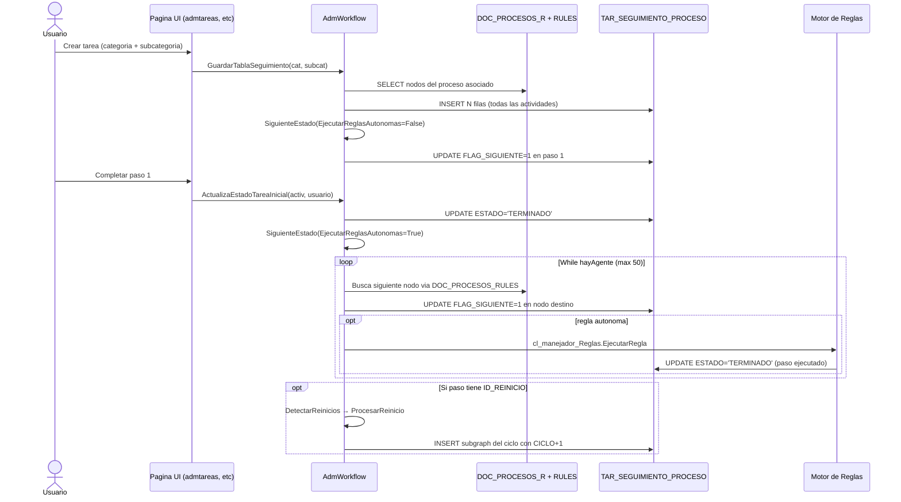

# Ejecucion del flujo (ORIGEN -> DESTINO): SiguienteEstado, reinicios, siembra

> Plano del port del avance de casos. Fija primero el mapeo al DESTINO
> (`WorkflowEngine` en .NET 10) y conserva el analisis del ORIGEN
> (`AdmWorkflow.vb`, VB) como reglas de negocio a preservar. Enlaza con
> [[Visión y entorno]] y [[00 - Prototipo Final ECOREX]]; complementa
> [[AdmWorkflow - Motor de ejecucion]].

## D. Encuadre DESTINO — las 5 funciones portadas

| Origen (`AdmWorkflow`) | Destino (`WorkflowEngine`) | Como cambia en .NET 10 |
|---|---|---|
| `GuardarTablaSeguimiento` | `SeedCaseAsync` | INSERT masivo concatenado -> insert transaccional EF Core; `TenantId` + Guid v7 en cada fila de `workflow_step_history` |
| `SiguienteEstado` (while <=50) | `AdvanceAsync` | mismo tope anti-ciclo, pero en **transaccion** + concurrencia optimista + emision de eventos de dominio por transicion |
| `ActualizaEstadoTareaInicial` | `CompleteStepAsync` | UPDATE estado -> comando tipado; dispara `AdvanceAsync(runAutonomousRules:true)` |
| `DetectarReinicios` | `DetectRestartsAsync` | deteccion de nodos con `ID_REINICIO` -> `restart_node_id` |
| `ProcesarReinicio` (CTE recursivo) | `ProcessRestartAsync` | el CTE recursivo se preserva como SQL nativo del `IEcorexDbContext` (Postgres `WITH RECURSIVE` / SQL Server `;WITH`); `cycle_index++` |

Reglas de negocio que el destino DEBE preservar exactamente:

- **Tope de 50 iteraciones** en el avance en cascada (proteccion anti-loop-infinito
  de flujos mal modelados; alimenta el KPI `workflow_stuck_rate`).
- **Semantica append-only** de los ciclos: cada vuelta crea filas nuevas con
  `cycle_index++`, nunca borra las viejas (auditoria completa).
- **`runAutonomousRules=false` al sembrar**: el caso recien creado no dispara
  reglas del paso 1 hasta que el usuario cargue datos.
- **Filtrado de usuarios por ciclo** (`CYCLESTART`): en ciclos sucesivos solo
  participan los usuarios que ejecutaron en el ciclo previo.

El CTE recursivo de `ProcesarReinicio` (clonado de la subgraph del ciclo) es la
consulta mas sofisticada del motor; en el destino se mantiene como SQL nativo
por rendimiento, envuelto en el DAL dual y cubierto por tests de round-trip en
ambos motores. La correccion clave es que hoy va sin transaccion ni `TenantId`
fuerte: el destino lo envuelve en transaccion y filtro global.

---

> A continuacion, el ANALISIS DEL ORIGEN (`AdmWorkflow.vb`, legacy VB) como
> referencia de migracion.

# Ejecución del flujo [ORIGEN] — `SiguienteEstado` + reinicios + creación inicial

> Esta ficha documenta **cómo el motor avanza un caso paso a paso por el flujo BPMN**. Es la parte de `AdmWorkflow.vb` que no estaba en [[AdmWorkflow - Motor de ejecucion]] (esa ficha cubrió los primeros 300 lines — descubrimiento de actividad actual + permisos + plugins).

---

## 1. Las 5 funciones clave de ejecución

| Función | Cuándo se llama | Qué hace |
|---|---|---|
| `GuardarTablaSeguimiento(Sucursal, Caso, Categoria, SubCategoria)` | Al CREAR un caso nuevo (primera vez) | INSERT masivo de todas las actividades válidas del proceso en `TAR_SEGUIMIENTO_PROCESO`, marca FLAG_INA=1 a las no aplicables, llama `SiguienteEstado` para activar el primer paso |
| `SiguienteEstado(Sucursal, Caso, EjecutarReglasAutonomas)` | Después de completar cada paso | **While loop hasta 50 iteraciones** que avanza FLAG_SIGUIENTE de paso en paso ejecutando reglas autónomas en cascada |
| `ActualizaEstadoTareaInicial(activ, usuario)` | Cuando el usuario termina un paso | UPDATE estado a 'TERMINADO' + llama `SiguienteEstado` |
| `DetectarReinicios()` | Periódicamente / al avanzar | Detecta nodos con `ID_REINICIO` listos para abrir un nuevo ciclo |
| `ProcesarReinicio(IdCaso, IdActividad, CodProceso)` | Disparado por DetectarReinicios | **CTE recursivo** que clona la subgraph del ciclo BPMN con `ACTIVIDAD_CICLO += 1` |

---

## 2. `GuardarTablaSeguimiento` — siembra del caso

Cuando un usuario crea una tarea nueva (categoría + subcategoría), el motor instancia **todas las actividades** del proceso asociado en `TAR_SEGUIMIENTO_PROCESO`.

### Lógica

```sql
INSERT INTO TAR_SEGUIMIENTO_PROCESO (
   SUCURSAL, PROCESO, FECHA_REG, ACTIVIDAD, ACTIVIDAD_PADRE,
   ACTIVIDAD_PASO, ACTIVIDAD_CICLO, ACTIVIDAD_NOMBRE,
   ENCARGADO, FLAG_APROBACION, ESTADO, ID_CASO, ID_REINICIO,
   FLUJO, PERMITE_ASIGNACION, TAR_CARGO
)
SELECT DOC_PROCESOS_R.SUCURSAL, DOC_PROCESOS_R.PROCESO, dbo.Getdate3dev(),
       DOC_PROCESOS_R.ID_ELEMENTO,             -- el nodo BPMN
       DOC_PROCESOS_R.ID_ELEMENTO_PADRE,
       DOC_PROCESOS_R.PASO,
       0 AS CICLO,                              -- ciclo inicial = 0
       DOC_PROCESOS_R.NOMBRE,
       ISNULL(t.USUARIO,'') AS USUARIO,         -- usuario expandido por fn_ConsultaCargo
       CASE WHEN ID_ELEMENTO LIKE '%Gateway%'   -- gateways = decisiones (requieren aprobación)
            THEN 1 ELSE 0 END AS FLAG_APROBACION,
       'PENDIENTE' AS ESTADO,
       @caso,
       DOC_PROCESOS_R.ID_REINICIO,
       DOC_PROCESOS_R.FLUJO,
       DOC_PROCESOS_R.PERMITE_ASIGNACION,
       PERMISO_CARGO.CARGO
FROM DOC_PROCESOS_R
LEFT JOIN PERMISO_CARGO CROSS APPLY fn_ConsultaCargo(PERMISO_CARGO.CARGO) AS t
       ON PERMISO_CARGO.SUCURSAL = DOC_PROCESOS_R.SUCURSAL
      AND PERMISO_CARGO.REFERENCIA2 = DOC_PROCESOS_R.PROCESO
      AND PERMISO_CARGO.REFERENCIA3 = DOC_PROCESOS_R.ID_ELEMENTO
WHERE DOC_PROCESOS_R.SUCURSAL = @sucursal
  AND (PERMISO_CARGO.MODULO = 'PROCESOS_USUARIOS' OR ISNULL(ID_REINICIO,'') <> '')
  AND DOC_PROCESOS_R.PROCESO IN (
      SELECT TIPO_TAR_R_PRO.PROCESO
      FROM TIPO_TAR_R
      LEFT JOIN TIPO_TAR_R_PRO ON TIPO_TAR_R_PRO.PEDREG = TIPO_TAR_R.REG
      WHERE TIPO_TAR_R.CATEGORIA = @categoria
        AND TIPO_TAR_R.CODIGO    = @subcategoria
        AND TIPO_TAR_R_PRO.PROCESO IS NOT NULL
        AND TIPO_TAR_R.SUCURSAL = DOC_PROCESOS_R.SUCURSAL)
  AND NOT EXISTS (...)  -- evita duplicados
```

### Después del INSERT

1. **UPDATE FLAG_INA**: marca como inactivas las filas que ya no tienen un cargo válido asignado (cambios en ACL al vuelo).
2. **Call `SiguienteEstado(Sucursal, Caso, EjecutarReglasAutonomas:=False)`** — activa el primer paso del flujo (FLAG_SIGUIENTE=1) **sin ejecutar reglas autónomas** (el caso recién creado no debe disparar nada todavía).

---

## 3. `SiguienteEstado` — el while loop del motor (hasta 50 iteraciones)

> Esta es **la pieza más compleja** del motor. Avanza el `FLAG_SIGUIENTE` siguiendo las aristas `DOC_PROCESOS_RULES` y dispara reglas autónomas en cascada hasta que se queda esperando interacción humana o se acaban las 50 iteraciones.

### Pseudocódigo de alto nivel

```
While hayAgente AND iteracion < 50:
    iteracion += 1
    hayAgente = False

    # Busca pasos completados que tengan siguiente paso definido en DOC_PROCESOS_RULES
    SELECT pasos con ESTADO='TERMINADO' y FLAG_SIGUIENTE=1

    Para cada paso terminado:
        Encontrar siguiente nodo via DOC_PROCESOS_RULES.ID_ACTIVIDAD = paso.ACTIVIDAD
        UPDATE TAR_SEGUIMIENTO_PROCESO SET FLAG_SIGUIENTE=1 WHERE ACTIVIDAD = siguiente

    # Reglas autónomas
    Si EjecutarReglasAutonomas:
        Para cada nuevo paso activado:
            Si ese paso tiene regla autónoma (no manual):
                Ejecutar regla
                Marcar paso como TERMINADO
                hayAgente = True  # vuelve a iterar
    Else:
        # solo activa el primer paso, no avanza más
        hayAgente = False
```

### Por qué un while loop con 50 max

Permite que el motor avance **N pasos automáticos en una sola operación**: si después de aprobar un paso humano, los siguientes 3 son reglas auto-ejecutables, el motor los corre todos antes de devolver el control al UI. El cap 50 es protección anti-loop-infinito en flujos mal diseñados.

### `EjecutarReglasAutonomas` flag

- `True` (default): ejecuta cascada automática
- `False`: solo avanza el FLAG_SIGUIENTE al siguiente paso, no dispara reglas. Usado al crear el caso (no queremos ejecutar reglas del paso 1 antes de que el usuario haya cargado nada).

---

## 4. `DetectarReinicios` + `ProcesarReinicio` — soporte de LOOPS BPMN

BPMN permite ciclos (el flujo "vuelve atrás" desde un gateway). El motor implementa esto con `ACTIVIDAD_CICLO` (incremental) y `ID_REINICIO` (nodo destino del loop).

### `DetectarReinicios()` — encuentra nodos a reciclar

```sql
SELECT ACTIVIDAD, PROCESO
FROM TAR_SEGUIMIENTO_PROCESO
WHERE ID_CASO = @caso
  AND SUCURSAL = @sucursal
  AND ID_REINICIO <> ''                    -- nodo configurado para iniciar ciclo
  AND FLAG_SIGUIENTE = 1                   -- el paso ya está activo
  AND NOT EXISTS (
      SELECT * FROM TAR_SEGUIMIENTO_PROCESO AS A
      WHERE A.ID_CASO = TAR_SEGUIMIENTO_PROCESO.ID_CASO
        AND A.ACTIVIDAD_PADRE = TAR_SEGUIMIENTO_PROCESO.ACTIVIDAD
        AND A.ACTIVIDAD_CICLO = TAR_SEGUIMIENTO_PROCESO.ACTIVIDAD_CICLO + 1
  )  -- todavía no se ha creado el ciclo siguiente
```

Para cada uno: marca el paso actual como `ESTADO='TERMINADO'` y llama `ProcesarReinicio`.

### `ProcesarReinicio(IdCaso, IdActividad, CodProceso)` — clona la subgraph con CTE recursivo

> **Esta es una de las consultas SQL más sofisticadas del sistema.**

```sql
-- 1. Variables
DECLARE @id_reinicio varchar(100), @id_actividad varchar(100), @num_ciclo int
SET @id_actividad = @IdActividad
SELECT @num_ciclo = ISNULL(MAX(ACTIVIDAD_CICLO),0) + 1 FROM TAR_SEGUIMIENTO_PROCESO WHERE ID_CASO=@IdCaso
SELECT @id_reinicio = ID_REINICIO FROM TAR_SEGUIMIENTO_PROCESO WHERE ACTIVIDAD=@id_actividad

-- 2. Snapshot estructural del proceso (todos los nodos con sus padres)
DECLARE @PROCESO_R TABLE (ID_ELEMENTO VARCHAR(100), ID_ELEMENTO_PADRE VARCHAR(100))
INSERT INTO @PROCESO_R SELECT DISTINCT ID_ELEMENTO, ID_ELEMENTO_PADRE FROM DOC_PROCESOS_R WHERE SUCURSAL = @sucursal

-- 3. CTE recursivo: encuentra TODA la subgraph desde @id_reinicio hacia adelante
;WITH Recursive_CTE (ID_ELEMENTO, ID_ELEMENTO_PADRE, NIVEL) AS (
    -- Caso base: el nodo de reinicio
    SELECT ID_ELEMENTO, @id_actividad AS ID_ELEMENTO_PADRE, 1 AS NIVEL
    FROM @PROCESO_R
    WHERE ID_ELEMENTO = @id_reinicio

    UNION ALL

    -- Recursión: hijos del CTE
    SELECT R.ID_ELEMENTO, R.ID_ELEMENTO_PADRE, CTE.NIVEL + 1
    FROM @PROCESO_R AS R
    INNER JOIN Recursive_CTE AS CTE ON R.ID_ELEMENTO_PADRE = CTE.ID_ELEMENTO
)
-- 4. INSERT las copias de los nodos en TAR_SEGUIMIENTO_PROCESO con CICLO+1
INSERT INTO TAR_SEGUIMIENTO_PROCESO (..., ACTIVIDAD_CICLO, FLAG_SIGUIENTE, CYCLESTART, ...)
SELECT ..., @num_ciclo, CASE WHEN NIVEL=1 THEN 1 ELSE 0 END, ...
FROM DOC_PROCESOS_R
LEFT JOIN PERMISO_CARGO CROSS APPLY fn_ConsultaCargo(...) AS t ON ...
WHERE PROCESO = @CodProceso
  AND ID_ELEMENTO IN (SELECT ID_ELEMENTO FROM Recursive_CTE)
  AND NOT EXISTS (... evita duplicados ...)

-- 5. Limpieza: elimina usuarios del ciclo nuevo que no estuvieron activos en el ciclo inicial
DELETE FROM TAR_SEGUIMIENTO_PROCESO
WHERE ID_CASO=@IdCaso AND ACTIVIDAD_CICLO <> 0 AND CYCLESTART=1
  AND EXISTS (
      SELECT * FROM TAR_SEGUIMIENTO_PROCESO AS A
      WHERE A.ID_CASO = TAR_SEGUIMIENTO_PROCESO.ID_CASO
        AND A.ACTIVIDAD_CICLO = 0
        AND A.CYCLESTART = 0
        AND A.USUARIO_EJECUTOR <> ''
        AND A.ENCARGADO <> TAR_SEGUIMIENTO_PROCESO.ENCARGADO
  )
```

### Qué logra esta lógica

- **Permite ciclos infinitos** en BPMN: cada vuelta crea filas nuevas con `ACTIVIDAD_CICLO++`
- **Auditoría completa**: cada iteración queda registrada (no se borran las viejas)
- **`CYCLESTART=1`** marca el primer nodo de cada ciclo (el nodo al que se "regresa")
- **Filtrado inteligente**: en ciclos sucesivos, solo participan los usuarios que ejecutaron en el ciclo previo (evita "olvidados")

---

## 5. Esquema completo de `TAR_SEGUIMIENTO_PROCESO` (31 cols)

| Columna | Tipo | Rol |
|---|---|---|
| `REG` | int | PK |
| `SUCURSAL` | varchar(5) | Tenant |
| `PROCESO` | varchar(10) | Código de proceso |
| `FECHA_REG` | date | Cuándo se creó la fila |
| `ACTIVIDAD` | varchar(50) | `DOC_PROCESOS_R.ID_ELEMENTO` (nodo BPMN) |
| `ACTIVIDAD_PADRE` | varchar(50) | Padre estructural (subprocesos) |
| `ACTIVIDAD_PASO` | int | `DOC_PROCESOS_R.PASO` |
| **`ACTIVIDAD_CICLO`** | int | **Iteración del loop** (0 = primer ciclo) |
| `ACTIVIDAD_NOMBRE` | varchar(300) | Snapshot del nombre |
| `ENCARGADO` | varchar(50) | Usuario expandido por `fn_ConsultaCargo` |
| `FLAG_APROBACION` | tinyint | 1 si el nodo es Gateway (decisión) |
| `ESTADO` | varchar(50) | `PENDIENTE` / `TERMINADO` |
| `ID_CASO` | varchar(50) | ID del caso (tarea concreta) |
| `APROBADO` | varchar(20) | Resultado de aprobación en gateways |
| `USUARIO_APROBADO` | varchar(25) | Quién aprobó |
| `TEXTO_APROBADO` | ntext | Comentario de la aprobación |
| `FECHA_MOD` | date | Última modificación |
| **`FLAG_INA`** | tinyint | 1 = inactivado (cambios en ACL) |
| **`FLAG_SIGUIENTE`** | tinyint | **1 = paso pendiente actual (el que el usuario debe atender)** |
| `FECHA_RES` | datetime | Cuándo se resolvió |
| `FECHA_ENTREGA` | datetime | SLA |
| `FECHA_INI` | datetime | Inicio efectivo |
| `ID_REINICIO` | varchar(100) | Nodo destino si éste inicia un loop |
| `FLUJO` | varchar(5) | Sub-flujo al que pertenece |
| `USUARIO_EJECUTOR` | varchar(25) | Quién ejecutó (puede diferir de ENCARGADO si se delegó) |
| **`CYCLESTART`** | tinyint | 1 = primer nodo de un ciclo |
| `PERMITE_ASIGNACION` | varchar(5) | Política del nodo |
| `ASIGNADO` | varchar(25) | Usuario al que se reasignó manualmente |
| `ACTIVIDAD_ORIGEN_SUBFLUJO` | varchar(100) | Si viene de un sub-flujo, su nodo padre |
| `ESTADO_SEGUIMIENTO` | varchar(5) | Estado de tracking adicional |
| `TAR_CARGO` | int | FK a la tabla de cargos |

---

## 6. Esquema completo de `DOC_PROCESOS_RULES` (aristas BPMN)

| Columna | Tipo | Notas |
|---|---|---|
| `REG` | int | PK |
| `SUCURSAL` | varchar(5) | |
| `PROCESO` | varchar(5) | |
| **`ID_ACTIVIDAD_ORIGEN`** | varchar(100) | Nodo de origen (FK a `DOC_PROCESOS_R.ID_ELEMENTO`) |
| **`ID_ACTIVIDAD`** | varchar(100) | Nodo destino |
| `ORIGEN` | varchar(25) | (¿identificador BPMN del sequence flow?) |
| `DESTINO` | varchar(25) | (¿identificador BPMN del sequence flow?) |

> Esquema simple — solo arista A→B. **No hay condiciones** de gateway en este modelo. Para gateways con N salidas, hay N filas y la condición se resuelve en la regla asociada al nodo gateway.

---

## 7. Esquema de `PERMISO_CARGO` (ACL por nodo BPMN)

| Columna | Tipo | Notas |
|---|---|---|
| `CARGO` | varchar | Cargo (numérico tipo `583`) |
| `MODULO` | varchar | `'PROCESOS_USUARIOS'` para BPMN |
| `REFERENCIA` | varchar | Vacío para BPMN |
| `REFERENCIA2` | varchar | `PROCESO` (ej. `00024`) |
| `REFERENCIA3` | varchar | **`ID_ELEMENTO`** del nodo BPMN (ej. `Activity-0gyhzby`, `Gateway-1y2uon5`, `Event-1g49oq2`) |
| `SUCURSAL` | varchar | Tenant |
| `CARGO_REG` | varchar | Registro del cargo |
| `FECHA_REG` | datetime | |
| `REG` | int | PK |
| `TOKEN` | varchar | Token contextual |

**Formato observado de `ID_ELEMENTO`:** `Activity-XXXXXXX`, `Gateway-XXXXXXX`, `Event-XXXXXXX` (prefijo tipo BPMN + guion + hash).

---

## 8. Esquema de `TIPO_TAR_R` + `TIPO_TAR_R_PRO`

### `TIPO_TAR_R` — Categoría/subcategoría de tareas (16 cols)

| Columna | Tipo | Notas |
|---|---|---|
| `REG` | int | PK |
| `CATEGORIA` | varchar | Categoría top-level |
| `CODIGO` | varchar | Subcategoría (código) |
| `NOMBRE` | varchar | Nombre visible |
| `CHEQUEO` | varchar | (flag de validación) |
| `SUCURSAL` | varchar | Tenant |
| `PLUGINS` | varchar | Plugins aplicables |
| `TITULO_ACT` | int | |
| `USUARIO` | varchar | Quién registró |
| `PROCESO` | varchar | Proceso BPMN asociado |
| `DESCRIPCION` | varchar | |
| `FLAG_INICIA_MODULO` | bit | Si la categoría es entry-point de un módulo |
| `FLAG_BOTON_CIERRE` | bit | Si muestra botón de cierre |
| `TITULO_AUTO` | nvarchar | Plantilla de título automático |
| `DETALLE_AUTO` | nvarchar | Plantilla de detalle automático |
| `FLAG_CLIENTE` | tinyint | Si aplica a portal cliente |

### `TIPO_TAR_R_PRO` — Mapping subcategoría ↔ proceso (5 cols)

| Columna | Tipo | Notas |
|---|---|---|
| `REG` | int | PK |
| `USUARIO` | varchar | Quién creó el mapping |
| `PEDREG` | int | FK → `TIPO_TAR_R.REG` |
| `PROCESO` | varchar | Proceso BPMN |
| `SUCURSAL` | varchar | Tenant |

> Permite que **una subcategoría tenga múltiples procesos** asociados. Al crear el caso, el motor crea instancias de **todos** los procesos relevantes.

---

## 9. Resumen del ciclo de vida de un caso



---

## 10. TODO

- [ ] Documentar `fn_ConsultaCargo` (UDF) — cómo expande un cargo a usuarios
- [ ] Documentar `dbo.Getdate3dev()` (UDF que devuelve la fecha local con timezone correcto)
- [ ] Confirmar el rol del campo `DOC_PROCESOS_RULES.ORIGEN` y `DESTINO` (¿IDs BPMN de sequence flows?)
- [ ] Investigar dónde se invoca `EjecutarRegla` cuando es autónoma — el motor sí lo hace pero no encontré el call site en AdmWorkflow.vb (300-600 leídos). Probablemente está en líneas 600+
- [ ] Catalogar todos los valores posibles de `TAR_SEGUIMIENTO_PROCESO.ESTADO_SEGUIMIENTO`
