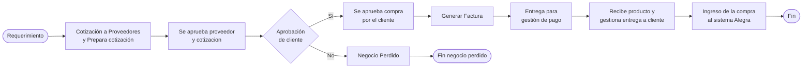

# Parametrizacion por nodo (ORIGEN -> DESTINO)

> El panel de propiedades por nodo del ORIGEN (8 acordeones ASP.NET) se
> reconstruye en el DESTINO como un panel **Blazor** ligado al evento
> `element.click` de bpmn-js via JS interop. Fija primero el encuadre destino y
> conserva el analisis del origen. Enlaza con [[Visión y entorno]],
> [[Visión y entorno|Prototipo Final ECOREX]] y [[00 - Visión Flujos]].

## D. Encuadre DESTINO — panel de propiedades Blazor

En el origen, seleccionar un nodo dispara un `__doPostBack` que el servidor
resuelve por SQL y devuelve combos rellenos (por eso el click programatico no lo
abre — ver seccion 4). En el destino esto se vuelve reactivo:

1. bpmn-js emite `element.click` -> JS interop invoca un metodo `[JSInvokable]`
   Blazor con el `ID_ELEMENTO` (ahora `node_id`, Guid v7).
2. El componente `WorkflowNodePropertiesPanel` consulta por EF Core y renderiza
   los acordeones (Configuracion Basica, Asignar Usuarios, Recursos/Componentes,
   Reglas, Sub-flujos) sin postback, con estado en cliente.

La parametrizacion NO viaja en el XML (que sigue siendo BPMN 2.0 estandar puro,
`isExecutable="false"`, cero `extensionElements`) sino en tablas relacionales,
ahora normalizadas con FK reales y `TenantId`:

| Configuracion del panel (origen) | Tabla origen | Entidad destino |
|---|---|---|
| Nombre/detalle, reasignacion, reinicio | `DOC_PROCESOS_R` | `workflow_node` |
| Asignar Usuarios (ACL por nodo) | `PERMISO_CARGO` | `workflow_node_policy` -> policy .NET |
| Recursos / formularios por paso | `GEN_COMPONENTES_R` | `workflow_node_component` -> FK a `dynamic_form` |
| Plugins (mail/OCR/GPT) por paso | `DOC_PROCESOS_PLUGINS` | `workflow_node_plugin` |
| Sub-flujo anidado | `DOC_PROCESOS_R.FLUJO` | `workflow_node.sub_definition_id` |
| Reglas asociadas al nodo | tabla puente (via `FORX_DATA`/`ctrReglas`) | `workflow_node_rule` -> `RulesEngine` |

Correccion clave del destino: al recolocar/renombrar un nodo, el origen debe
tocar 5 tablas sin FK (propenso a inconsistencia silenciosa); el destino usa FK
reales con `ON DELETE` controlado y una transaccion de sincronizacion editor->BD.

---

> A continuacion, el ANALISIS DEL ORIGEN (panel legacy ASP.NET) como referencia.

# Parametrización por nodo [ORIGEN] — el panel "Diseño (Propiedades)"

> [!success] Hallazgo clave
> Al seleccionar un nodo en el canvas, el panel lateral derecho **"Diseño (Propiedades)"** expone **8 acordeones** con la configuración específica de ese nodo. La configuración NO se guarda dentro del XML BPMN — el XML es 100% estándar OMG sin extensiones — sino en tablas relacionales separadas (`DOC_PROCESOS_R`, `DOC_PROCESOS_PLUGINS`, `GEN_COMPONENTES_R`, `PERMISO_CARGO`, etc.).
>
> Esto significa: el **diseño visual es portable** (cualquier herramienta BPMN puede abrir el `.bpmn`) pero **la semántica ejecutable es propietaria** y vive en las tablas.

---

## 1. Estructura del panel Propiedades

| Acordeón (id HTML) | Sección | Controles ASP.NET |
|---|---|---|
| `collapseBasicProps` | **Configuración Básica** | `cmbreinicioact` (combo Reinicio actividad), `cmbflujoif` (combo Flujo IF / decisión), `txtdetalle` (textarea Nombre/Detalle del nodo), `cmbreasignacion` (combo Política de reasignación) |
| `modcollapse0` | **Asignar Usuarios** | Grid de usuarios (cargado dinámicamente por SignalR/postback) |
| `collapse1m` | **Recursos y Componentes** | `txtinpeccion` (textarea Inspección/observación), `ctrFlujoActividades.ddlSubFlujoProceso` (combo sub-flujo), 3 combos del control `ctrReglas` (ver abajo) |
| `collapse2m` | (vacío en mi captura — probable carga lazy) | — |
| `collapse3m` | (vacío en mi captura) | — |
| `collapse4m` | **Inspección** (heredada) | `txtinpeccion` |
| _id base64 (oculto)_ | **Agregar sub flujos** | Botón + combo para anidar sub-procesos BPMN |
| `collapsePropiedad2` | **Reglas** | `ctrReglas` (3 combos reutilizables): `cmbgruporegla`, `cmbreglas`, `cmbreglastarea` |

### Anatomía del UserControl `ctrReglas` (reutilizable)

| Combo | Rol | Fuente probable |
|---|---|---|
| `cmbgruporegla` | Grupo de reglas (filtro/paraguas) | `CONTROL_REGLAS.GRUPO` distinct |
| `cmbreglas` | Documento de reglas del grupo | `CONTROL_REGLAS.DOCUMENTO` filtrado por grupo |
| `cmbreglastarea` | Regla específica dentro del documento | `CONTROL_REGLAS_R` filtrado por `REGLA` = documento elegido |

→ Permite asociar **cualquier regla (de los 8 documentos vistos en producción)** a **cualquier nodo del flujo**. Vínculo concreto: regla individual seleccionada → se almacena en una tabla puente que liga `(SUCURSAL, PROCESO, ID_ELEMENTO)` con `CONTROL_REGLAS_R.REG`. Tabla puente pendiente identificar (candidatos: `DOC_PROCESOS_PLUGINS` con `COMPONENTE='REGLA'`, o tabla específica `DOC_PROCESOS_REGLAS`).

### Anatomía del UserControl `ctrFlujoActividades`

Combo `ddlSubFlujoProceso` — permite **anidar un sub-flujo** dentro del nodo actual (BPMN call activity / subprocess).

---

## 2. Comparación: XML BPMN vs Tablas custom

### Lo que va en el XML (BPMN 2.0 estándar puro)

```xml
<?xml version="1.0" encoding="UTF-8"?>
<bpmn2:definitions
    xmlns:bpmn2="http://www.omg.org/spec/BPMN/20100524/MODEL"
    xmlns:bpmndi="http://www.omg.org/spec/BPMN/20100524/DI"
    xmlns:dc="http://www.omg.org/spec/DD/20100524/DC"
    xmlns:di="http://www.omg.org/spec/DD/20100524/DI"
    id="sample-diagram"
    targetNamespace="http://bpmn.io/schema/bpmn">

  <bpmn2:process id="Process_1" isExecutable="false">
    <bpmn2:startEvent id="Event_09gcxpb" name="Requerimiento">
      <bpmn2:outgoing>Flow_0wlkxd6</bpmn2:outgoing>
    </bpmn2:startEvent>

    <bpmn2:task id="Activity_1wx9i90" name="Cotización a Proveedores Y Prepara cotización">
      <bpmn2:incoming>Flow_0wlkxd6</bpmn2:incoming>
      <bpmn2:outgoing>Flow_1ro0roy</bpmn2:outgoing>
    </bpmn2:task>

    <bpmn2:sequenceFlow id="Flow_0wlkxd6"
                        sourceRef="Event_09gcxpb"
                        targetRef="Activity_1wx9i90" />
    <!-- ... 41 elementos más ... -->
  </bpmn2:process>

  <bpmndi:BPMNDiagram>...</bpmndi:BPMNDiagram>  <!-- coordenadas visuales -->
</bpmn2:definitions>
```

> **Esto y solo esto** va en el XML. **Sin extensiones Camunda, sin extensionElements, sin atributos custom**.
>
> Confirma el hash de las namespaces: solo `bpmn2`, `bpmndi`, `dc`, `di`, `xsi` (todos OMG).

### Lo que NO va en el XML — vive en tablas relacionales

| Configuración del panel | Tabla destino | Comentario |
|---|---|---|
| Nombre del nodo (`txtdetalle`) | `DOC_PROCESOS_R.NOMBRE` | Duplicado del `name` BPMN (sync bidirectional) |
| Permite asignación (`cmbreasignacion`) | `DOC_PROCESOS_R.PERMITE_ASIGNACION` | Política |
| Reinicio de actividad (`cmbreinicioact`) | `DOC_PROCESOS_R.ID_REINICIO` | Para loops |
| Flujo IF (`cmbflujoif`) | (probablemente) `DOC_PROCESOS_R.ID_ELEMENTO_PADRE` o `FOR_PROCESO` | Decisión condicional |
| Asignar Usuarios | `PERMISO_CARGO` con `MODULO='PROCESOS_USUARIOS'` + `REFERENCIA2=PROCESO` + `REFERENCIA3=ID_ELEMENTO` | ACL por nodo (cargo→usuario via UDF `fn_ConsultaCargo`) |
| Recursos / Componentes (formularios) | `GEN_COMPONENTES_R` con `MODULO='FLUJO_PROCESO'` + `REFERENCIA=ID_ELEMENTO` + `FORMULARIO=ENCUESTAS_MOV.CODIGO` | Forms asociados al paso |
| Plugins por paso | `DOC_PROCESOS_PLUGINS` | Mail, OCR, GPT, etc. |
| Sub-flujo anidado (`ddlSubFlujoProceso`) | `DOC_PROCESOS_R.FLUJO` (cadena de sub-flujos) | Llamada a subproceso |
| Reglas asociadas | tabla puente pendiente identificar — candidatos: `DOC_PROCESOS_PLUGINS COMPONENTE='REGLA'` o `DOC_PROCESOS_REGLAS` | Reglas del motor `cl_manejador_Reglas` |
| Inspección (`txtinpeccion`) | (probable) `DOC_PROCESOS_R.DETALLE` | Texto libre de observaciones |

---

## 3. Flujo real explorado — `COMERCIAL REQUERIMIENTO INFRAESTRUCTURA Y TECNOLOGIA (00001)`

42 elementos BPMN, 15.9 KB de XML:

| Tipo BPMN | Conteo | Ejemplos |
|---|---|---|
| `bpmn:Process` | 1 | Process_1 |
| `bpmn:StartEvent` | 1 | "Requerimiento" |
| `bpmn:EndEvent` | 2 | (cierre normal + cancelación) |
| `bpmn:Task` | 8 | Cotización, Aprobación, Generar Factura, Entrega, Ingreso compra, Negocio Perdido, ... |
| `bpmn:ExclusiveGateway` | 3 | "Aprobación de cliente", "El cliente rechaza regresa a se aprueba" |
| `bpmn:SequenceFlow` | 13 | Aristas dirigidas |
| `bpmn:TextAnnotation` | 7 | Notas adjuntas |
| `bpmn:Association` | 7 | Vínculo nota ↔ elemento |

### Diagrama lógico (deducido de los nombres)



---

## 4. La instancia bpmn-js — APIs descubiertas

`window.bpmnModeler` está expuesto globalmente y permite manipulación programática:

| Variable global | Tipo | Uso |
|---|---|---|
| `BpmnJS` | constructor | la clase del modelador |
| `bpmnModeler` | instancia activa | el editor con el flujo actual cargado |
| `BpmnJSColorPicker` | módulo addon | colores de fondo de nodos |
| `diagramShape` / `diagramUrl` | strings | estado del diagrama actual |
| `nuevoFlujo()` | función | crea un flujo en blanco |
| `exportDiagram()` | función | exporta XML |
| `openDiagram(xml)` | función | carga un XML al canvas |
| `restartbmpnModeler()` | función | reinicia el modelador |
| `refreshBpmnCanvas()` | función | redibuja |

### Cómo programmaticamente interactuar (útil para tests / migración)

```javascript
// 1. Listar todos los elementos del flujo
const reg = bpmnModeler.get('elementRegistry');
const all = reg.getAll().filter(e => e.type?.startsWith('bpmn:'));

// 2. Seleccionar un nodo
const sel = bpmnModeler.get('selection');
sel.select(reg.get('Activity_1wx9i90'));

// 3. Exportar el XML
const { xml } = await bpmnModeler.saveXML({ format: true });

// 4. Importar un XML
await bpmnModeler.importXML(xmlString);

// 5. Suscribirse a clicks de nodos
bpmnModeler.get('eventBus').on('element.click', (e) => {
   console.log('Selected:', e.element.id, e.element.businessObject.name);
});
```

> [!warning] Click programático NO dispara panel ASP.NET
> Probé `eventBus.fire('element.click', {element})` y `selection.select()` — el panel "Diseño (Propiedades)" **no se renderiza** porque depende de un postback ASP.NET (`__doPostBack`) que se dispara desde el listener real del canvas (mouse). El servidor recibe el `ID_ELEMENTO` y rellena los combos por SQL.
>
> Para tests E2E hay que usar **un click real de mouse** (Playwright / Selenium), no la API de bpmn-js sola.

---

## 5. Implicaciones para migración

### 🟢 Lo bueno

1. **El XML es 100% portable.** Cualquier sistema BPMN 2.0 lo abre tal cual:
   - Camunda Platform 7/8
   - Activiti
   - Flowable
   - Bizagi
   - bpmn.io (la librería sola)
2. **Reutilizar el mismo `bpmn-js`** en el destino (.NET 10 Blazor / Angular / React) — es framework-agnostic.
3. **Las coordenadas visuales** (`bpmndi:BPMNDiagram`) están en el XML — el flujo se ve igual al re-abrirlo.

### 🟡 Lo medio

1. **El motor de ejecución es propietario** (`AdmWorkflow` + `DOC_PROCESOS_R`/`_RULES`/`_PLUGINS` + `TAR_SEGUIMIENTO_PROCESO`). Para migrar, hay 2 opciones:
   - **Opción A — Mantener motor propietario**: portar `AdmWorkflow` a C# / .NET Core preservando las mismas tablas (con UUID + EF Core).
   - **Opción B — Adoptar Camunda/Flowable**: convertir `DOC_PROCESOS_R` + `_RULES` + `_PLUGINS` a `extensionElements` Camunda y migrar a su motor (`bpmn:extensionElements > camunda:executionListener`, `camunda:formField`, etc.). Esto da BPMN ejecutable + monitor estándar + features avanzados.

2. **Las relaciones nodo↔(usuarios/forms/reglas/plugins) están en 5 tablas distintas.** Al renombrar `ID_ELEMENTO` del nodo BPMN (por ejemplo al recolocar uno), hay que actualizar 5 tablas. Sin FK física, propenso a inconsistencias.

### 🔴 Lo malo

1. **`isExecutable="false"`** — el XML no es ejecutable. El motor ignora la semántica BPMN estándar (gateways condicionales, timers, message events) y solo respeta el grafo dirigido.
2. **No hay condiciones expresables en BPMN puro** para las decisiones (los gateways son meras "flechas múltiples" — la condición vive en las reglas asociadas, fuera del XML).
3. **No hay timers/message events nativos** — si el flujo requiere "esperar 3 días" o "responder a evento externo", se implementa en `AdmWorkflow` con plugins, no en BPMN.

---

## 6. TODO

- [ ] Identificar tabla puente nodo ↔ regla (¿`DOC_PROCESOS_PLUGINS COMPONENTE='REGLA'` o tabla específica?)
- [ ] Capturar UI del panel **con un nodo seleccionado** (Win+Shift+S manual — bloqueado por necesitar click real de mouse)
- [ ] Documentar `cmbreasignacion` valores posibles (consultar BD)
- [ ] Documentar política `ID_REINICIO` para loops
- [ ] Probar exportar el XML del flujo `00001` y abrirlo en bpmn.io online para verificar fidelidad visual
- [ ] Revisar `bpmndi:BPMNDiagram` para entender coordenadas visuales (X, Y, width, height por nodo)

---

## 7. Enlace al XML completo

XML del flujo `00001 COMERCIAL REQUERIMIENTO INFRAESTRUCTURA Y TECNOLOGIA` (15.9 KB) guardado en [[ejemplo-bpmn-flujo-00001.bpmn]] dentro de esta misma carpeta para referencia técnica.
