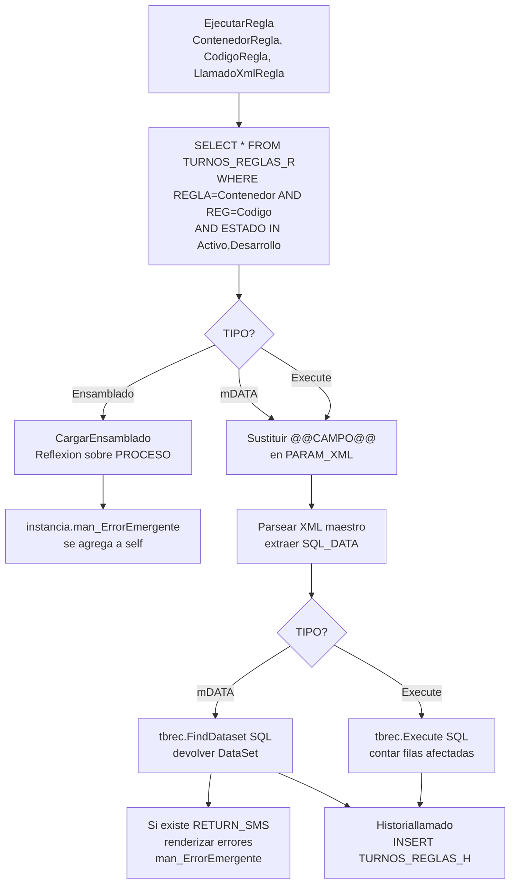

# Motor de Reglas (ORIGEN -> DESTINO): discrepancia legacy y correccion

> Analisis del motor de reglas del ORIGEN, cuyo hallazgo central es una
> **discrepancia estructural**: el administrador escribe en `CONTROL_REGLAS*`
> pero el ejecutor generico `cl_manejador_Reglas` lee de tablas
> (`TURNOS_REGLAS_R`) que no existen en `db3dev` -> esta roto. Fija primero como
> el DESTINO elimina esta clase de error y conserva el analisis. Enlaza con
> [[Visión y entorno]] (seccion 9), [[Visión y entorno|Prototipo Final ECOREX]] y
> [[Reglas - Quien invoca realmente (cierre)]].

## D. Encuadre DESTINO — RulesEngine

La discrepancia del origen (admin y ejecutor apuntando a tablas distintas, una
inexistente, con fallo silencioso) es precisamente el tipo de error que el
destino hace imposible por construccion:

- **Una sola fuente de verdad**: `RulesEngine` (port de `cl_gestion_reglas`, el
  motor real — ver [[Reglas - Quien invoca realmente (cierre)]]) lee y escribe
  las mismas entidades EF Core (`rule_document`, `rule`, `rule_history`), sin
  aliases duplicados (`[dbx.GENE]` vs `[dbx.TURNOS]`) ni ramas legacy.
- **Verbos tipados**: los 3 modos declarados (`mDATA`/`Execute`/`Ensamblado`) —
  de los que solo Ensamblado esta implementado (ver
  [[Reglas - Catalogo real y verbos Ensamblado]]) — se formalizan en un
  **registro tipado** (`IReadOnlyDictionary<string, IRuleVerb>`). No hay
  `Activator.CreateInstance` sobre un nombre de clase que venga del XML (vector
  RCE del origen); cada verbo se registra explicito en DI.
- **Historial garantizado y auditado**: `rule_history` (port de
  `CONTROL_REGLAS_H`) recibe SIEMPRE la escritura (el origen la mandaba a
  `TURNOS_REGLAS_H` inexistente -> se perdia). Auditoria inmutable.
- **Modo `Execute` seguro**: el SQL directo del origen se ejecuta en sandbox con
  whitelist y prohibicion de concatenacion (riesgo #5 de [[Visión y entorno]]).
- **Fallo explicito**: si un verbo no resuelve, el destino lanza excepcion
  tipada, no retorna un `DataSet` vacio en silencio.

La clase legacy `cl_manejador_Reglas` NO se porta: se marca obsoleta en el ETL y
su funcionalidad viva la absorbe `RulesEngine`.

---

> A continuacion, el ANALISIS DEL ORIGEN (motor legacy y su discrepancia).

# Motor de Reglas [ORIGEN] — `cl_manejador_Reglas` + página admin `gen_reglas`

> [!danger] Hallazgo crítico — Discrepancia administrador ↔ ejecutor
> **La página administradora `gen_reglas.aspx` escribe en `CONTROL_REGLAS` + `CONTROL_REGLAS_R` (en `[dbx.GENE]`)**.
>
> **El ejecutor `cl_manejador_Reglas.EjecutarRegla` lee de `TURNOS_REGLAS_R` (en `[dbx.GENE]`) y escribe historial en `TURNOS_REGLAS_H` (en `[dbx.TURNOS]`)**.
>
> **`TURNOS_REGLAS_R` y `TURNOS_REGLAS_H` NO EXISTEN en `db3dev`** (consultado a INFORMATION_SCHEMA.TABLES). Por lo tanto **`EjecutarRegla` falla silenciosamente** en este entorno — el `FindDataset` devuelve un dataset vacío, el `For Each` no entra, `Xml_master_regla = ""`, y el `Select Case` no encuentra match → la función retorna `New DataSet` sin hacer nada.
>
> O bien:
> - El alias `[dbx.TURNOS]` apunta a una BD distinta donde sí existen estas tablas, y `EjecutarRegla` también la usa para `_R`. Pero el código tiene `[dbx.GENE].dbo.TURNOS_REGLAS_R` (NOT `[dbx.TURNOS]`).
> - O el ejecutor está **desactualizado** respecto al administrador y nunca se actualizó después del rename `TURNOS_REGLAS_R → CONTROL_REGLAS_R`.
> - O esa función simplemente no se usa hoy y todas las reglas se ejecutan por otro camino.

---

## 1. Administrador: `gen_reglas.aspx.vb` (módulo 000802)

### Tablas que administra (todas en `[dbx.GENE]`)

| Tabla | Cols | Rol |
|---|---|---|
| `CONTROL_REGLAS` | 12 | **Cabecera del documento de reglas**: REG, DOCUMENTO (PK lógica varchar 25), SUCURSAL, FECHA, FECHA_INI, FECHA_FIN, OBSERVACION, USUARIO, FECHA_NOV, ESTADO, NOMBRE, GRUPO |
| `CONTROL_REGLAS_R` | 10 | **Reglas individuales del documento**: REG (PK), NOMBRE, SUCURSAL, TIPO, ORDEN (int), PARAM_XML (ntext), REGLA (= `CONTROL_REGLAS.DOCUMENTO`), DESCRIPCION, ESTADO, SCRIPT |
| `CONTROL_REGLAS_F` | 7 | Configuraciones especiales (UPDATE ESTADO='Inactivo' visto) |
| `CONTROL_REGLAS_H` | 9 | Historial |

### Estados, tipos y campos

| Campo | Valores posibles |
|---|---|
| `CONTROL_REGLAS.ESTADO` | `Activo` / `Desarrollo` / `Inactivo` |
| `CONTROL_REGLAS_R.TIPO` | `mDATA` / `Execute` / `Ensamblado` (los 3 modos del motor) |
| `CONTROL_REGLAS_R.ESTADO` | `Activo` / `Desarrollo` / `Inactivo` |
| `CONTROL_REGLAS_R.ORDEN` | int — secuencia de ejecución (editable inline en grid) |

### Wiring con Formularios

La página tiene `cmbformualario` (combo) que se llena con **TODOS los formularios disponibles** del tenant:
```vb
sql_t = "SELECT CODIGO + ' (' + TITULO + ')' AS NAME, CODIGO AS CODE
         FROM [dbx.GENE].dbo.ENCUESTAS_MOV
         WHERE CODIGO <> '' AND SUCURSAL = @empresa
         ORDER BY TITULO"
Optimize.ComboFill(sql_t, "Selecciona formulario", cmbformualario, BASE_SISTEMA)
```

→ esto sugiere que **las reglas pueden estar bound a un formulario específico**, no solo a un paso del flujo BPMN.

### CRUD principal

| Operación | SQL |
|---|---|
| Crear cabecera | `INSERT INTO CONTROL_REGLAS (SUCURSAL, DOCUMENTO, USUARIO, FECHA_NOV, OBSERVACION, ESTADO, NOMBRE, GRUPO) VALUES (@e, @doc, @usr, getdate(), @obs, 'Desarrollo', @nom, @grp)` |
| Editar | `UPDATE CONTROL_REGLAS SET OBSERVACION=, NOMBRE=, GRUPO=, ESTADO= WHERE DOCUMENTO=` |
| Eliminar | `DELETE FROM CONTROL_REGLAS WHERE DOCUMENTO=` + `DELETE FROM CONTROL_REGLAS_R WHERE DOCUMENTO=` |
| Crear regla detalle | `INSERT INTO CONTROL_REGLAS_R (SUCURSAL, REGLA, TIPO, ORDEN, PARAM_XML, NOMBRE, DESCRIPCION, ESTADO, SCRIPT) OUTPUT INSERTED.REG VALUES (...)` |
| Editar regla detalle | `UPDATE CONTROL_REGLAS_R SET ... WHERE REG=@reg` |
| Reordenar regla | `UPDATE CONTROL_REGLAS_R SET ORDEN=@nuevoOrden WHERE REG=@reg` |
| Inactivar config | `UPDATE CONTROL_REGLAS_F SET ESTADO='Inactivo' WHERE REG=@reg` |

### Página: estructura visual

- `cmbdocumento` — combo principal con los documentos de reglas existentes
- `txtnombre`, `txtdescripcion`, `txtgrupo`, `cmbestado` — cabecera
- Modal "Reglas" (`PanelTarea`) con:
  - `cmbtipoejecucion` (mDATA/Execute/Ensamblado)
  - `txtordenejecucion`, `txtnombreregla`, `txtfuncion` (DESCRIPCION)
  - `txtconfiguracionregla` (PARAM_XML — editor de XML)
  - `txtprevioscript` (SCRIPT)
  - `cmbestadotarearegla`
  - `LiteralGuardado`, `LiteralErrorsql` (resultado)
  - `ListViewError` (errores)
- Modal "Configuraciones" (`PanelConfiguracion`) — relacionado con `CONTROL_REGLAS_F`
- `GridHistorico` — tabla histórica de reglas
- `ctrFormDinamico` — control que renderiza el formulario asociado (oculto por default: `IsVisible = False`)

---

## 2. Ejecutor: `Funciones.Reglas.AdminReglas.cl_manejador_Reglas`

Archivo: `C:\Desarrollo\core\Funciones\Reglas\AdminReglas\cl_manejador_Reglas.vb`

### API

| Miembro | Tipo | Descripción |
|---|---|---|
| `Sucursal` | Property String | Tenant |
| `Usuario` | Property String | Quién ejecuta |
| `ErrorSql` | Property String | Mensaje de error del último Execute |
| `man_ErrorEmergente` | `List(Of ErrorEmergente)` | Mensajes acumulados durante la ejecución (Usuario + Tecnico) |
| `EjecutarRegla(ContenedorRegla, CodigoRegla, LlamadoXmlRegla) As DataSet` | Function | **Núcleo** — ejecuta una regla individual |
| `PreparacampoTipo(Tipo, Valor) As String` | Function | Formatea valores según tipo (FECHA → `Cadena.FormatDateDB`) |
| `MensajeRespuestaProceso(XmlDocumentMaster, ds) As Sub` | Sub | Renderiza errores emergentes a partir del dataset retornado por `mDATA` |
| `Historiallamado(...)` | Sub | INSERT en `TURNOS_REGLAS_H` |
| `CargarEsamblado(nombreClase, LlamadoXmlRegla, ContenedorRegla)` | Sub | Reflexión: `Type.GetType(nombreClase)` + `Activator.CreateInstance` + setea `CargaXml`, `DocParametros`, `usuario` + invoca `CargarEnsamblado()` |

### Cómo funciona `EjecutarRegla`



### Sustitución de variables (`@@CAMPO@@`)

El XML del cliente (`LlamadoXmlRegla`) viene con nodos `<CorXml><CAMPO>X</CAMPO><TIPO>Y</TIPO><VALOR>Z</VALOR></CorXml>`. Por cada uno se reemplaza `@@X@@` por el VALOR (formateado según TIPO) dentro del `PARAM_XML` del registro maestro.

### Modo `Ensamblado` (reflexión)

```vb
Dim tipoClase As Type = Type.GetType(nombreClase)   ' viene de XML maestro nodo PROCESO
Dim instancia As Object = Activator.CreateInstance(tipoClase)
instancia.CargaXml = LlamadoXmlRegla
instancia.DocParametros = ContenedorRegla
instancia.usuario = Me.Usuario
instancia.CargarEnsamblado()
For Each q In instancia.man_ErrorEmergente
    man_ErrorEmergente.Add(...)
Next
```

→ **Permite cargar clases arbitrarias por nombre**. Vector de ejecución remota de código si `nombreClase` viene de input del usuario. **Riesgo de seguridad si el PARAM_XML viene de UI sin sanitizar**.

### Historial: `TURNOS_REGLAS_H`

```sql
INSERT INTO [dbx.TURNOS].dbo.TURNOS_REGLAS_H
(USUARIO, FECHA_REG, REGLA, CODIGO, LLAMADO, REGISTROS, MSG_ERROR, DURACION)
VALUES (@usr, getdate(), @cont, @cod, @xml, @cantRegistros, @errorSql, @duracion)
```

> `[dbx.TURNOS]` es un alias DIFERENTE de `[dbx.GENE]`. Apunta probablemente a otra BD del esquema legacy.

---

## 3. Discrepancia entre admin y ejecutor — análisis

| Aspecto | Admin (`gen_reglas.aspx`) | Ejecutor (`cl_manejador_Reglas`) |
|---|---|---|
| Cabecera | `CONTROL_REGLAS` (12 cols) | (no lee cabecera, va directo al detalle) |
| Detalle (lectura) | `CONTROL_REGLAS_R` | **`TURNOS_REGLAS_R`** ❌ |
| Detalle (escritura) | `CONTROL_REGLAS_R` | n/a (no escribe detalle) |
| Historial | n/a | `TURNOS_REGLAS_H` (en `[dbx.TURNOS]`, otro alias) |
| Estado en db3dev | ✅ existe | ❌ `TURNOS_REGLAS_R` no existe |

### Hipótesis (a confirmar con el usuario o más código)

1. **Refactor inconcluso**: el equipo renombró `TURNOS_REGLAS_R → CONTROL_REGLAS_R` en algún momento pero olvidó actualizar `cl_manejador_Reglas.vb`. Resultado: las reglas se administran pero **no se ejecutan** desde este código.

2. **Otra ruta de ejecución**: las reglas se ejecutan desde otro lugar (¿`AdmWorkflow`? ¿un proc almacenado?) y `cl_manejador_Reglas` es legacy.

3. **Alias mal escrito**: el código debería decir `[dbx.TURNOS].dbo.TURNOS_REGLAS_R` (con alias TURNOS) en lugar de `[dbx.GENE].dbo.TURNOS_REGLAS_R`. Si la BD `TURNOS` sí existe en producción, allá sí podría existir la tabla.

4. **`db3dev` está incompleto**: tal vez en producción (`SERVERI_MAR` real) sí existen `TURNOS_REGLAS_R`/`_H` y son tablas legacy nunca migradas. → consultar `[dbx.TURNOS]` alias real en `alias.xml`.

### Verificación rápida

```sql
-- ¿Existen TURNOS_REGLAS_* en algún catálogo accesible?
SELECT TABLE_CATALOG, TABLE_SCHEMA, TABLE_NAME
FROM INFORMATION_SCHEMA.TABLES
WHERE TABLE_NAME LIKE 'TURNOS_REGLA%'

-- ¿Qué cataloga el alias [dbx.TURNOS]? — leer alias.xml en App\Datos\
```

---

## 4. `cl_doc_reglas_documental` (placeholder)

Archivo: `C:\Desarrollo\core\Funciones\Reglas\Documentales\cl_doc_reglas_documental.vb`

Clase **casi vacía** (95 líneas, solo properties + un Sub vacío):

| Propiedad | Tipo |
|---|---|
| `DocParametros` | String |
| `Usuario` | String |
| `Sucursal` | String |
| `Formulario` | String |
| `Referencia` | String |
| `Referenciaii` | String |
| `RegTabla` | String |
| `Sub doc_asignar_barras()` | **Stub vacío** |

Estructura `MensajeEmergente` definida pero no usada.

→ **Clase placeholder**, probablemente reservada para reglas específicas de documentos del módulo TRD (compartido con DokTrino). En este proyecto Tareas no aporta.

---

## 5. Relación con el motor de Flujos

| Mecanismo de enlace | Probable | Confirmado |
|---|---|---|
| `CONTROL_REGLAS_R.REGLA` ↔ formulario o paso del proceso | sí — `cmbformualario` combobox apunta a `ENCUESTAS_MOV` | parcial |
| Disparo desde `AdmWorkflow` al avanzar de paso | sugerido por properties `HayReglasManualesPendientes` y `OrdenSiguienteManual` | pendiente confirmar (leer más de AdmWorkflow.vb) |
| `FORX_DATA.ID_REGLA` + `ORDEN_REGLA` | columnas confirmadas en SQL — registran qué regla generó cada respuesta | sí — vínculo claro reglas ↔ respuestas |

---

## 6. TODO

- [ ] Confirmar dónde apunta el alias `[dbx.TURNOS]` (leer `App\Datos\alias.xml` en runtime, o pedir al usuario que ejecute `SELECT * FROM AliasCon` desde dentro del runtime).
- [ ] Si `TURNOS_REGLAS_R` no existe en ningún catálogo → confirmar al usuario que el motor `cl_manejador_Reglas` está roto / no se usa, y rastrear quién más invoca `EjecutarRegla` (grep).
- [ ] Leer las columnas restantes de `DOC_PROCESOS_RULES` y `CONTROL_REGLAS_F`.
- [ ] Capturar UI de `gen_reglas.aspx` (necesita usuario con permiso al módulo 000802 — el demo `1048064705` no tiene).
- [ ] Documentar el flujo Modal Reglas paso a paso (10+ eventos `Linkbutton*_Click` no leídos aún).
