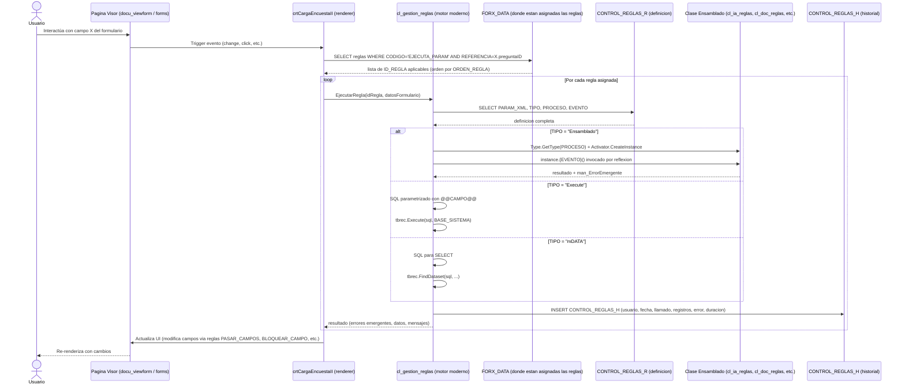

# RulesEngine (DESTINO) — quien ejecuta las reglas realmente (cierre ORIGEN)

> Esta nota es la **referencia del port del motor de reglas** citada por
> [[Visión y entorno]] (seccion 9, `cl_gestion_reglas -> RulesEngine`). Cierra el
> misterio del origen: el ejecutor generico `cl_manejador_Reglas` esta roto, pero
> las reglas si se ejecutan — via `cl_gestion_reglas` (en Bootstrap). Fija primero
> el contrato DESTINO y conserva el analisis del origen. Enlaza tambien con
> [[00 - Prototipo Final ECOREX]], [[Reglas - Motor y discrepancia]] y
> [[Reglas - Catalogo real y verbos Ensamblado]].

## D. RulesEngine — contrato destino

`RulesEngine` porta a .NET 10 el motor REAL del origen (`cl_gestion_reglas`, que
vive en Bootstrap, no en Funciones). Contrato conceptual:

```csharp
public interface IRulesEngine
{
    // Reemplaza cl_gestion_reglas.EjecutarRegla — pero con verbos tipados
    Task<RuleResult> ExecuteAsync(Guid tenantId, Guid ruleId, RuleContext ctx, CancellationToken ct);

    // Reglas asignadas a un campo/paso (hoy en FORX_DATA CODIGO='EJECUTA_PARAM')
    Task<IReadOnlyList<Guid>> GetRulesForFieldAsync(Guid tenantId, string questionId, CancellationToken ct);
}
```

Correspondencia ORIGEN -> DESTINO:

| Origen | Destino | Correccion |
|---|---|---|
| `cl_gestion_reglas` (Bootstrap) | `RulesEngine` (Application) | motor real portado, unica fuente |
| `cl_manejador_Reglas` (Funciones) | (no se porta) | legacy roto -> descartado en ETL |
| `Activator.CreateInstance(PROCESO)` | registro `IRuleVerb` en DI | elimina el vector RCE |
| `FORX_DATA CODIGO='EJECUTA_PARAM'` | `field_rule_binding` | FK real a `dynamic_form_field` + `rule` |
| `CONTROL_REGLAS_H` (o `TURNOS_REGLAS_H`) | `rule_history` | historial siempre escrito y auditado |
| `crtCargaEncuestaII` (dispara reglas) | `DynamicFormRenderer` (Blazor) | dispara `RulesEngine` en interaccion de campo |

**Invocacion desde el flujo**: cada nodo del `WorkflowEngine` (ver
[[AdmWorkflow - Motor de ejecucion]]) que tenga reglas asociadas invoca
`RulesEngine.ExecuteAsync`. Asi se cierra el triangulo Flujos + Formularios +
Reglas del destino (secciones 7, 8, 9 de [[Visión y entorno]]).

**Que se preserva del origen**: el patron de asignacion regla<->campo, el
protocolo `PARAM_XML` con `@@CAMPO@@` como formato de configuracion, y el
catalogo de 21 verbos (ver [[Reglas - Catalogo real y verbos Ensamblado]]). Lo
que se corrige: fuente unica, verbos tipados, historial garantizado, sin RCE, y
todo multi-tenant por `TenantId` + filtro global + RLS.

---

> A continuacion, el ANALISIS DEL ORIGEN que cierra el misterio de quien ejecuta.

# ¿Quién ejecuta realmente las reglas? [ORIGEN] — Cierre del misterio

> Esta nota cierra el hilo abierto en [[Reglas - Motor y discrepancia]]: el ejecutor genérico `cl_manejador_Reglas` (en `Funciones`) busca tablas `TURNOS_REGLAS_R` que no existen → está roto. Pero las reglas **sí se ejecutan** en producción. ¿Quién las dispara?

---

## 1. Las clases que realmente ejecutan reglas (en Bootstrap, no en Funciones)

Grep `cl_manejador_Reglas|Activator.CreateInstance|EjecutarRegla` arroja **14 archivos**. Los relevantes para reglas modernas:

| Archivo | Rol |
|---|---|
| `Bootstrap\Formularios\Modulos\Documental\Clases\`**`cl_gestion_reglas.vb`** | **Motor moderno de gestión de reglas** — reemplaza/extiende `cl_manejador_Reglas`. Vive en Bootstrap, no en Funciones |
| `Bootstrap\Formularios\Modulos\Documental\Clases\`**`cl_gestion_campo.vb`** | Gestión de campos del formulario y sus reglas asociadas |
| `Bootstrap\Formularios\Modulos\Documental\Reglas\`**`cl_ia_reglas_formularios.vb`** | Clase específica para reglas IA (la que invoca `GENERAR_TEXTO_IA`) |
| `Bootstrap\Formularios\Modulos\Documental\Controles\`**`crtCargaEncuestaII.ascx.vb`** | El renderer del formulario — dispara reglas al interactuar con campos |
| `Funciones\Reglas\AdminReglas\cl_manejador_Reglas.vb` | El ejecutor genérico LEGACY (apunta a `TURNOS_REGLAS_R` inexistente — roto) |
| `Funciones\Reglas\Documentales\cl_doc_reglas_documental.vb` | Stub vacío usado por `EXPANDIR_BARRAS` (la regla está en `Desarrollo` por eso) |

> **Conclusión rápida**: el motor real vive en `Bootstrap` (la app web), no en `Funciones`. `cl_gestion_reglas` y `crtCargaEncuestaII` son las piezas activas.

---

## 2. El mapeo verbo → clase .NET (confirmado por PARAM_XML)

Tomando el primer verbo y leyendo su `PARAM_XML` real:

**`EXPANDIR_BARRAS` (regla `00001`, ESTADO `Desarrollo`):**
```xml
<PagXml>
   <CorXml>
      <NOMBRE>ENSAMBLADO_DATA</NOMBRE>
      <PROCESO><![CDATA[Funciones.cl_doc_reglas_documental, Funciones]]></PROCESO>
      <EVENTO><![CDATA[doc_asignar_barras]]></EVENTO>
   </CorXml>
   ...
</PagXml>
```

→ Apunta a `Funciones.cl_doc_reglas_documental.doc_asignar_barras()` que es el método **stub vacío** que documentamos en [[00 - Visión MotherData|MotherData/funciones]]. Por eso la regla está en estado `Desarrollo` — la implementación nunca se completó.

### Lo importante del PARAM_XML

| Nodo | Rol |
|---|---|
| `<PROCESO>` | **Type assembly-qualified name** estilo .NET: `Namespace.Clase, NombreAssembly` |
| `<EVENTO>` | Nombre del **método público sin parámetros** a invocar |
| `<CorXml NOMBRE="TEST_PARAM">` | Parámetros configurables que el operador edita en `gen_reglas.aspx` |

### Para los verbos activos (`00005 OPERACIONES DE FORMULARIOS`)

No tenemos el PARAM_XML literal de cada uno, pero por el patrón se infiere:
- `PASAR_CAMPOS` → probablemente `GestionMovil.cl_gestion_campo.pasar_campos` o equivalente en `cl_gestion_reglas`
- `BLOQUEAR_CAMPO_XCONDICION` → `cl_gestion_campo.bloquear_campo_condicion`
- `IMPORTAR_FORMULARIO_DB` → cl_gestion_reglas o similar
- `ASIGNAR_CONSECUTIVO` → invocará `Funciones.tipdoc.Consecutivo`
- `ABRIR_MODAL` → control del UI
- `EJECUTAR CONSULTA SQL` → tipo `Execute` (no Ensamblado) — SQL directo
- (TODO: consultar PARAM_XML de cada uno para confirmar)

### Los verbos de IA (`cl_ia_reglas_formularios`)

`GestionMovil.cl_ia_reglas_formularios` (en Bootstrap, no Funciones) contiene métodos como `doc_generar_tabla` (visto en PARAM_XML de `GENERAR_TEXTO_IA`). Maneja:
- Llamadas a OpenAI vía `Funciones.clChatGPT`
- Generación de tablas, autocompletado, transformaciones IA

---

## 3. Cómo se dispara realmente una regla

Hipótesis basada en lo leído (pendiente confirmar leyendo `cl_gestion_reglas.vb` completo):



> **Por confirmar**: el motor `cl_gestion_reglas` debería:
> 1. Escribir historial en `CONTROL_REGLAS_H` (no en `TURNOS_REGLAS_H` que no existe)
> 2. Leer `PARAM_XML` de `CONTROL_REGLAS_R` (no de `TURNOS_REGLAS_R`)
> 3. Mantener el patrón de sustitución `@@CAMPO@@`

---

## 4. ¿Por qué existe `cl_manejador_Reglas` si está roto?

Hipótesis (no validadas):

1. **Legacy de versión anterior**: cuando el sistema usaba alias `[dbx.TURNOS]` y tablas `TURNOS_REGLAS_*`. Al migrar a `CONTROL_REGLAS*` (en `GENE`), se actualizó el admin (`gen_reglas.aspx`) pero NO se actualizó `cl_manejador_Reglas`.
2. **Stub para compilar**: la clase existe para que el sistema compile, pero realmente nadie la invoca en runtime — el motor real (en Bootstrap) la ignora.
3. **Otro deploy**: tal vez en otro tenant (entorno con BD diferente) sí existen las tablas TURNOS_REGLAS_* y el código sí funciona allá.

### Acción recomendada
- **Marcar `Funciones.Reglas.AdminReglas.cl_manejador_Reglas` como `<Obsolete>`** en el proyecto Funciones
- O **eliminar** si se confirma que nadie lo invoca (grep de `cl_manejador_Reglas` en todo el código)

---

## 5. Resumen ejecutivo del sistema de Reglas — versión definitiva

| Capa | Componente | Estado real |
|---|---|---|
| **Diseñador** (UI) | `gen_reglas.aspx` (módulo 000802) | ✅ Activo |
| **Asignación regla ↔ campo** | `ctrReglas.ascx` + `FORX_DATA (CODIGO='EJECUTA_PARAM')` | ✅ Activo |
| **Definición** | `CONTROL_REGLAS` (cabecera) + `CONTROL_REGLAS_R` (verbos) + `CONTROL_REGLAS_F` (forms asociados) | ✅ Activo (8 docs, 21 reglas) |
| **Tipo if-then de campos** | `PROPIEDADES_REGLAS` (ORIGEN/DESTINO/VALOR) | ✅ Disponible (uso a verificar) |
| **Motor de ejecución moderno** | `Bootstrap.GestionMovil.cl_gestion_reglas` (Bootstrap/Documental/Clases) | ✅ Activo (probable) — leer detalle |
| **Renderer + disparador** | `crtCargaEncuestaII.ascx.vb` | ✅ Activo |
| **Verbos IA** | `cl_ia_reglas_formularios.vb` (Bootstrap/Documental/Reglas) | ✅ Activo |
| **Verbos documentales** | `Funciones.cl_doc_reglas_documental` | ⚠️ Stub vacío (regla `EXPANDIR_BARRAS` no funcional) |
| **Historial** | `CONTROL_REGLAS_H` | ✅ Activo |
| **Motor legacy** | `Funciones.cl_manejador_Reglas` | ❌ Roto (apunta a `TURNOS_REGLAS_R` inexistente) — marcar obsoleto |
| **Tabla legacy** | `REGLAS` + `REGLAS_HIS` + `REGLAS_SUC` | ❌ Reemplazada por `CONTROL_REGLAS*` |

---

## 6. TODO siguiente

- [ ] Leer `cl_gestion_reglas.vb` completo (motor real) y documentarlo aparte
- [ ] Leer `cl_gestion_campo.vb` (cómo gestiona reglas por campo)
- [ ] Leer `cl_ia_reglas_formularios.vb` (verbos IA)
- [ ] Leer `crtCargaEncuestaII.ascx.vb` completo (renderer + dispatcher de reglas)
- [ ] Sample el `PARAM_XML` de cada verbo del documento `00005` (los 6 verbos Activos)
- [ ] Verificar que `CONTROL_REGLAS_H` recibe escrituras (SELECT COUNT(*) y últimas filas)
