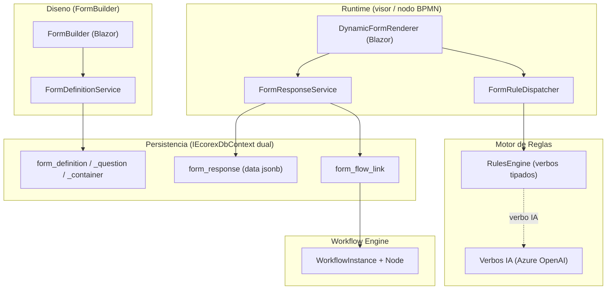

# Motores y renderers de formularios -- origen -> destino

> Mapea las clases/controles clave del motor de formularios del origen a sus
> sucesores en .NET 10, y conserva la anatomia del origen como reglas de negocio
> a preservar. Stack y arquitectura en [[Visión y entorno]]; el patron de
> persistencia en [[Constructor - Patron EAV y motor visual]].

---

## 1. Mapa origen -> destino (resumen)

| Origen (WebForms/VB) | Destino (.NET 10 / Blazor) | Responsabilidad |
|---|---|---|
| `cl_FormCreator` | `FormBuilder` + `FormDefinitionService` | CRUD de la definicion (preguntas, contenedores, versiones). |
| `crtCargaEncuestaII` | `DynamicFormRenderer` + `FormResponseService` | Renderiza la UI viva y captura respuestas. |
| `cl_gestion_reglas` | `RulesEngine` + `FormRuleDispatcher` | Ejecuta reglas de formulario (verbos tipados, sandbox). |
| `cl_ia_reglas_formularios` | verbos IA del `RulesEngine` | Reglas de IA (generar/autocompletar/clasificar). |
| `cl_gestion_campo` | binding por campo del renderer | Reglas por campo individual. |
| `cl_tree_componentes` | modelo `FormContainer` (arbol) | Estructura de secciones/contenedores. |

Principios transversales del destino: EF Core parametrizado (fin del SQLi del
origen), `IEcorexDbContext` dual, `TenantId` + `HasQueryFilter` + RLS,
transacciones en operaciones multi-tabla, concurrencia optimista.

---

## 2. `DynamicFormRenderer` (destino) <- `crtCargaEncuestaII`

El renderer es el componente mas importante del motor: **compone la UI a partir
de la definicion y captura las respuestas**. En Blazor es un componente que:

1. Carga `FormDefinition` + `FormQuestion` + `FormContainer` (equivalente a
   `CargarModelo()`).
2. Recorre el arbol de contenedores y, por cada pregunta, resuelve `ControlType`
   a un componente Blazor (renderer polimorfico, ver
   [[Constructor - Patron EAV y motor visual]] seccion 2).
3. Bindea cada control contra el documento `data` de la `FormResponse`.
4. Engancha los eventos de campo (change/blur/click) al `FormRuleDispatcher`.
5. Persiste via `FormResponseService.Guardar(...)` (equivalente a
   `GuardarFormulario(modo, validate)`), en transaccion.

Modos heredados de `crtCargaEncuestaII` (ahora parametros/estado del componente):
disenio vs produccion, con tabs vs plano (`FORM_CARPETA_VISOR`), auto-guardado,
botones visibles/ocultos, modo visor. `NuevoRegistro()`/`EliminarRegistro()` ->
metodos del `FormResponseService`.

---

## 3. `FormBuilder` + `FormDefinitionService` (destino) <- `cl_FormCreator`

El lado de disenio. `FormDefinitionService` expone el CRUD de la definicion:

| Metodo destino | Sucesor de | Operacion |
|---|---|---|
| `GuardarPregunta(FormQuestion)` | `GuardarPregunta` (14 params) | Upsert de `FormQuestion` (EF Core, no SQL concatenado). |
| `ExisteContenedor(...)` | `ExisteContenedor` | Valida unicidad de contenedor. |
| `GuardarContenedor(FormContainer)` | `GuardarContenedor` | Upsert de `FormContainer`. |
| `ListarDefiniciones(tenant)` | `ObtenerCuestionarios` | Lista para el grid del gestor. |

El patron origen `If COUNT>0 THEN UPDATE ELSE INSERT` se reemplaza por upsert
nativo (`ON CONFLICT DO UPDATE` en Postgres / `MERGE` en SQL Server) via EF Core.

---

## 4. `RulesEngine` + `FormRuleDispatcher` (destino) <- `cl_gestion_reglas`

El motor de reglas se comparte con Flujos (ver [[Reglas - Quien invoca realmente (cierre)]]).
En el contexto de formularios:

- El `FormRuleDispatcher` recibe eventos de campo del `DynamicFormRenderer` y
  resuelve que reglas aplican a ese campo (en el origen, filas `FORX_DATA` con
  `CODIGO='EJECUTA_PARAM'`; en el destino, asociacion en la definicion).
- El `RulesEngine` ejecuta cada regla como un **verbo tipado** en un sandbox
  (sin SQL directo, sin reflexion arbitraria). El origen usa reflexion
  (`Type.GetType` + `Activator.CreateInstance` + `MethodInfo`) sobre clases como
  `cl_ia_reglas_formularios`; el destino registra los verbos en un catalogo
  tipado (patron `IRuleVerb`).
- Los mensajes al usuario/tecnico (origen: `Structure MensajeEmergente` +
  `List(Of MensajeEmergente)`) -> resultado estructurado del `RulesEngine`
  (`RuleResult { Messages, IsError }`).

### Verbos IA <- `cl_ia_reglas_formularios`

Clase origen especializada en verbos IA (instanciada por reflexion cuando una
regla `Ensamblado` apunta a `GestionMovil.cl_ia_reglas_formularios`). Usa
`Funciones.clChatGPT` y `Funciones.clGPTPerTasks`. Metodo visto:
`doc_generar_tabla()` (verbo `GENERAR_TEXTO_IA`). En el destino, cada verbo IA es
un `IRuleVerb` que consume el servicio de IA (Azure OpenAI) con contexto de
tenant, sin instanciacion dinamica insegura.

---

## 5. Union de todo -- arquitectura del motor (destino)



---

# ORIGEN (referencia) -- clases del motor legacy

> Se conserva la anatomia de las 4 clases/controles activos en produccion
> (no `cl_manejador_Reglas`, que esta roto).

## O.1 `cl_FormCreator` -- API CRUD del constructor

**Path:** `Bootstrap\Formularios\Modulos\Documental\Clases\cl_FormCreator.vb`

| Metodo | Firma | Operacion |
|---|---|---|
| `GuardarPregunta` | 14 params (BASE, empresa, encuesta, regPregunta, pregunta, caption, tipoRespuesta, ayuda, respuestas, correctas, orden, obligatorio, preguntaOtra, columna, regTabla) | INSERT/UPDATE en `ENCUESTAS_MOV_PREGUNTAS`; devuelve `regGenerado` (OUTPUT INSERTED.REG). |
| `ExisteContenedor` | (BASE, empresa, encuesta, nombre, regExcluir) | Bool; verifica contenedor en `_T`. |
| `GuardarContenedor` | (BASE, empresa, encuesta, pedreg, tipo, orden, idPadre, style, nombre) | INSERT en `_T`. |
| `ObtenerCuestionarios` | (BASE, empresa, tabla) | DataSet para el grid. |

No maneja: reglas (`cl_gestion_reglas`), renderizado (`crtCargaEncuestaII`),
respuestas (el renderer). Estilo: SQL concatenado (SQLi) + patron
`COUNT->INSERT/UPDATE`. Corregido en destino (seccion 3).

## O.2 `crtCargaEncuestaII` -- RENDERER en runtime

**Path:** `Bootstrap\Formularios\Modulos\Documental\Controles\crtCargaEncuestaII.ascx.vb`

Genera la UI HTML dinamicamente desde `ENCUESTAS_MOV` + `_PREGUNTAS` +
`_PREGUNTAS_T` y maneja las respuestas. Propiedades clave: `LLAVE_ID`,
`LLAVE_TABLA_MAESTRA`, `CONSECUTIVO_ASIGNADO`, `CLAVE_PRIMARIA`,
`FORM_CARPETA_VISOR` (tabs vs plano), `FORM_AUTOGUARDADO`,
`OCULTAR_BOTON_GUARDADO`, `Produccion` (1=runtime, 0=disenio), `ModoVisor`,
`BotonesVisibles`, `Formscript`, `Formulario`, `noRegisterScript`,
`FormularioManejaError`.

Metodos: `CargarModelo()`, `GuardarFormulario(modo, validate)`,
`NuevoRegistro()`, `EliminarRegistro()`. Disparo de reglas: detecta interacciones
del usuario y consulta `FORX_DATA WHERE CODIGO='EJECUTA_PARAM'` para hallar las
reglas del campo, luego invoca `cl_gestion_reglas`. Variantes: `crtCargaEncuesta`
(V1) y `crtCargaEncuestaII` (V2, activa).

## O.3 `cl_gestion_reglas` -- motor moderno de reglas

**Path:** `Bootstrap\Formularios\Modulos\Documental\Clases\cl_gestion_reglas.vb`

Motor real (reemplaza al obsoleto `Funciones.cl_manejador_Reglas`). Imports:
`System.Reflection` (`Type.GetType` + `Activator.CreateInstance`),
`System.Security`, `System.Diagnostics`, `DocumentFormat.OpenXml.*`, `Funciones`,
`MotherData`. Propiedades: `Sucursal`, `Usuario`, `Formulario`, `Referencia`,
`Referenciaii`, `FormularioGuardado`, `Produccion`, `Modulo`,
`DATOS_UNICOS_POR_USUARIO`, `preDOC_PARAMXML`, `ErrorSql`, `DataReglas` (DataSet).

```vb
Public Structure MensajeEmergente
    Public Usuario As String
    Public Tecnico As String
    Public Mensaje As String
    Public flag_error As Boolean
End Structure
Public man_MensajeEmergente As New List(Of MensajeEmergente)
```

Metodos probables (leidas primeras 150 lineas): `EjecutarRegla(...)`,
`CargarReglas(formulario, referencia)`, `Historiallamado(...)` (INSERT en
`CONTROL_REGLAS_H`), `CargarEnsamblado(clase, evento)`.

## O.4 `cl_ia_reglas_formularios` -- reglas de IA

**Path:** `Bootstrap\Formularios\Modulos\Documental\Reglas\cl_ia_reglas_formularios.vb`

Instanciada por reflexion cuando una regla `Ensamblado` apunta a
`GestionMovil.cl_ia_reglas_formularios`. Usa `Funciones.clChatGPT` y
`Funciones.clGPTPerTasks`. Propiedades: `DocParametros`, `Usuario`, `Sucursal`,
`Formulario`, `Referencia`, `Referenciaii`, `RegTabla`, `CargaXml`. Metodo visto:
`doc_generar_tabla()` (verbo `GENERAR_TEXTO_IA`).

Patron de invocacion origen (inseguro -- reemplazado por verbos tipados):

```xml
<CorXml>
   <NOMBRE>ENSAMBLADO_DATA</NOMBRE>
   <PROCESO>GestionMovil.cl_ia_reglas_formularios, Bootstrap</PROCESO>
   <EVENTO>doc_generar_tabla</EVENTO>
</CorXml>
```

```vb
Dim tipoClase = Type.GetType("GestionMovil.cl_ia_reglas_formularios, Bootstrap")
Dim inst = Activator.CreateInstance(tipoClase)
inst.CargaXml = llamadoXmlRegla
inst.doc_generar_tabla()   ' invocado por MethodInfo
```

## O.5 Clases auxiliares del origen

| Clase | Path | Rol | Destino |
|---|---|---|---|
| `cl_gestion_campo` | `...\Documental\Clases\cl_gestion_campo.vb` | Reglas por campo | binding por campo del renderer |
| `cl_gestion_formularios` | (pendiente localizar) | Helper general | `FormResponseService` |
| `cl_tree_componentes` | `...\Documental\Clases\cl_tree_componentes.vb` | Arbol de contenedores | modelo `FormContainer` |
| `Funciones.cl_doc_reglas_documental` | `Funciones\Reglas\Documentales\...` | Stub vacio (regla `EXPANDIR_BARRAS` en Desarrollo) | descartar |

## O.6 Pendientes de lectura del origen

- `cl_gestion_reglas.vb` completo (firmas del ejecutor + historial).
- `cl_gestion_campo.vb` (reglas por campo).
- `crtCargaEncuestaII.ascx.vb` completo (dispatcher de reglas).
- `cl_FormCreator.vb` completo (metodos restantes).
- Localizar `cl_gestion_formularios`.
- Mapear los verbos `Ensamblado` a sus verbos tipados destino (PARAM_XML de cada uno).
