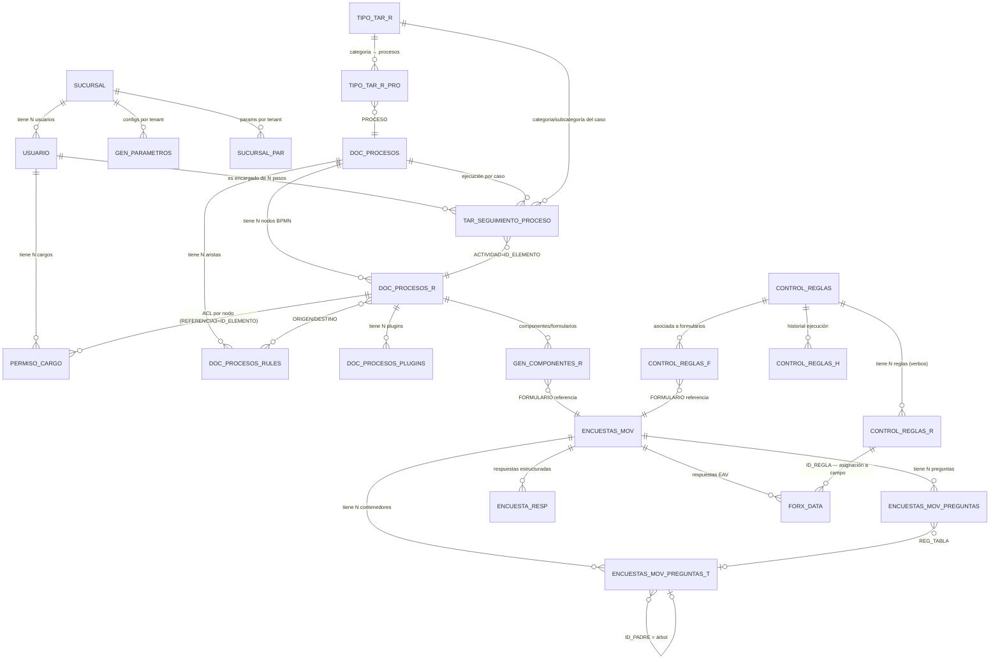
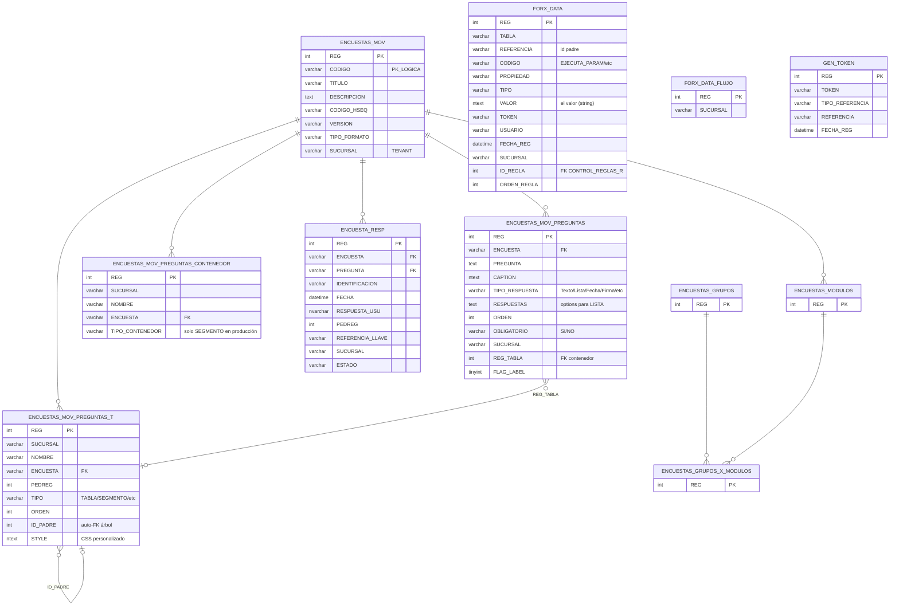
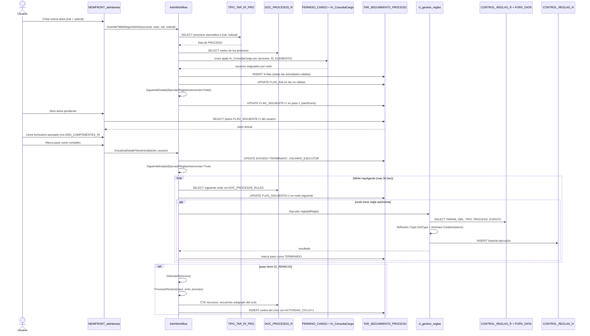

# Modelo Entidad-Relacion logico del sistema Tareas

> **Este documento es el plano del esquema EF Core DESTINO.** El modelo ER del
> ORIGEN (tablas SQL Server de `db3dev`, sin FKs fisicas) es el punto de partida:
> cada familia de tablas se reproyecta a entidades EF Core con `TenantId`,
> `HasQueryFilter` global y RLS en BD. Las secciones 1-8 conservan el modelo
> ORIGEN como referencia del ETL (que existe hoy, con que columnas, con que
> relaciones logicas). La **seccion 9 es el mapeo ORIGEN -> DESTINO**: la tabla
> que el desarrollador de .NET 10 usa para crear las entidades. Vision maestra en
> [[Visión y entorno]] (seccion 4 multi-tenant, 13 persistencia); aspecto en
> [[00 - Prototipo Final ECOREX]].

## 0. Principios del esquema DESTINO

Todo el modelo destino obedece cinco invariantes que corrigen el origen:

1. **Multi-tenant real.** El `SUCURSAL varchar` del origen (aislamiento por
   columna + disciplina) se vuelve `TenantId uuid NOT NULL` con filtro global
   `HasQueryFilter(x => x.TenantId == _tenantProvider.CurrentTenantId)` + RLS
   (`CREATE POLICY` Postgres / `SECURITY POLICY` SQL Server). Ninguna entidad
   transaccional escapa del filtro.
2. **DAL dual.** Las entidades viven una sola vez en `Domain`; los dos backends
   (`PostgresDbContext` / `SqlServerDbContext`) tras `IEcorexDbContext` deciden
   tipos fisicos (`jsonb` vs `nvarchar(max)`, `xmin` vs `rowversion`).
3. **PK moderna.** Las tablas nuevas usan `Guid` v7 (`uuid`) en vez de `int REG`.
   Las tablas migradas conservan su `REG` como `LegacyId` para trazar el ETL.
4. **Sin patron dual de datos.** `ENCUESTA_RESP` + `FORX_DATA` (EAV) consolidan
   en una entidad `FormResponse` con columna `Data` (`jsonb` / `nvarchar(max)`).
5. **Concurrencia optimista.** Toda entidad editable lleva token de version
   (`xmin` Postgres / `rowversion` SQL Server) contra doble edicion.

---

## 1. Diagrama maestro (las 5 capas)



---

## 2. Vista por dominio: FORMULARIOS



### Caminos de persistencia de respuestas

**Camino 1 — `ENCUESTA_RESP`**: 1 fila por pregunta respondida, con metadatos snapshot. Camino "tradicional" — fácil de consultar pero rígido.

**Camino 2 — `FORX_DATA`**: EAV puro. Flexible para cambios de esquema; lento para reportes. Es el camino moderno que también almacena reglas asignadas (`CODIGO='EJECUTA_PARAM'`).

---

## 3. Vista por dominio: FLUJOS BPMN

```mermaid
erDiagram
    DOC_PROCESOS {
        int REG PK
        varchar CODIGO PK_LOGICA
        varchar NOMBRE
        varchar SUCURSAL
        varchar DESCRIPCION
        int GPT_CODE
    }
    DOC_PROCESOS_R {
        int REG PK
        varchar SUCURSAL
        varchar PROCESO FK
        varchar NOMBRE
        int ORIGEN
        int DESTINO
        varchar FLUJO
        int PASO
        varchar ID_ELEMENTO "PK_LOGICA_BPMN"
        varchar ID_BPMN "estandar"
        varchar TIPO_BPMN "startEvent/task/gateway/endEvent"
        varchar ID_ELEMENTO_PADRE "subprocesos"
        varchar ID_REINICIO "para loops"
        varchar PERMITE_ASIGNACION
    }
    DOC_PROCESOS_RULES {
        int REG PK
        varchar SUCURSAL
        varchar PROCESO FK
        varchar ID_ACTIVIDAD_ORIGEN "FK nodo origen"
        varchar ID_ACTIVIDAD "FK nodo destino"
        varchar ORIGEN
        varchar DESTINO
    }
    DOC_PROCESOS_PLUGINS {
        int REG PK
        varchar SUCURSAL
        int PASO
        varchar PROCESO FK
        varchar COMPONENTE
        int ORDEN
        varchar FORMULARIO "FK ENCUESTAS_MOV"
        varchar TITULO
        ntext DETALLE
        varchar ID_ELEMENTO "FK nodo"
    }
    DOC_PROCESOS_GRUPOS {
        int REG PK
        varchar USUARIO
        varchar NOMBRE
        datetime FECHA_REG
        varchar SUCURSAL
    }
    DOC_PROCESOS_GRUPOS_USUARIOS {
        int REG PK
    }
    GEN_COMPONENTES_R {
        int REG PK
        varchar SUCURSAL
        varchar TIPO
        varchar COMPONENTE
        int ORDEN
        varchar FORMULARIO "FK ENCUESTAS_MOV"
        varchar TITULO
        ntext DETALLE
        varchar REFERENCIA "FK DOC_PROCESOS_R.ID_ELEMENTO"
        varchar MODULO "FLUJO_PROCESO"
    }
    TAR_SEGUIMIENTO_PROCESO {
        int REG PK
        varchar SUCURSAL
        varchar PROCESO
        varchar ACTIVIDAD "FK DOC_PROCESOS_R.ID_ELEMENTO"
        varchar ACTIVIDAD_PADRE
        int ACTIVIDAD_PASO
        int ACTIVIDAD_CICLO "para loops"
        varchar ACTIVIDAD_NOMBRE
        varchar ENCARGADO "FK USUARIO"
        tinyint FLAG_APROBACION
        varchar ESTADO "PENDIENTE/TERMINADO"
        varchar ID_CASO "FK al caso"
        tinyint FLAG_INA
        tinyint FLAG_SIGUIENTE "1 = paso pendiente actual"
        tinyint CYCLESTART
        varchar PERMITE_ASIGNACION
        varchar ID_REINICIO
        varchar FLUJO
        varchar USUARIO_EJECUTOR
        varchar ASIGNADO
        int TAR_CARGO "FK PERMISO_CARGO"
    }
    TIPO_TAR_R {
        int REG PK
        varchar CATEGORIA
        varchar CODIGO PK_LOGICA
        varchar NOMBRE
        varchar SUCURSAL
        varchar PROCESO "PK_LOGICA"
        bit FLAG_INICIA_MODULO
        bit FLAG_BOTON_CIERRE
        nvarchar TITULO_AUTO
    }
    TIPO_TAR_R_PRO {
        int REG PK
        int PEDREG "FK TIPO_TAR_R"
        varchar PROCESO "FK DOC_PROCESOS"
        varchar SUCURSAL
    }
    PERMISO_CARGO {
        int REG PK
        varchar CARGO
        varchar MODULO "PROCESOS_USUARIOS"
        varchar REFERENCIA
        varchar REFERENCIA2 "PROCESO"
        varchar REFERENCIA3 "ID_ELEMENTO"
        varchar SUCURSAL
        datetime FECHA_REG
    }
    TAR_WORKFLOW_PROYECTOS {
        int REG PK
        varchar SUCURSAL
        varchar PROYECTO
        varchar NOMBRE
        datetime FECHA_ACT
    }
    TAR_WORKFLOW_PASOS {
        int REG PK
        int ID_WF
        int STEP_ID
        varchar STEP_TYPE
        varchar STEP_LABEL
        int ORDEN
        nvarchar CONFIG_JSON
        varchar PROYECTO
        varchar SUCURSAL
    }
    TAR_WORKFLOW_HORARIOS {
        int REG PK
        int ID_PASO
        int RANGE_ID
        varchar START_DATE
        varchar END_DATE
        varchar START_TIME
        varchar END_TIME
        varchar ACTIVE_DAYS
        varchar PROYECTO
        varchar SUCURSAL
        int REPEAT_EVERY
        int PACKAGE_SIZE
    }

    DOC_PROCESOS ||--o{ DOC_PROCESOS_R : ""
    DOC_PROCESOS ||--o{ DOC_PROCESOS_RULES : ""
    DOC_PROCESOS_R }o--o{ DOC_PROCESOS_RULES : "ORIGEN/DESTINO"
    DOC_PROCESOS_R ||--o{ DOC_PROCESOS_PLUGINS : ""
    DOC_PROCESOS_R ||--o{ GEN_COMPONENTES_R : ""
    DOC_PROCESOS_R ||--o{ PERMISO_CARGO : "ACL por nodo"
    DOC_PROCESOS_R ||--o{ TAR_SEGUIMIENTO_PROCESO : "ejecución"
    TIPO_TAR_R ||--o{ TIPO_TAR_R_PRO : ""
    DOC_PROCESOS ||--o{ TIPO_TAR_R_PRO : ""
    TAR_WORKFLOW_PROYECTOS ||--o{ TAR_WORKFLOW_PASOS : ""
    TAR_WORKFLOW_PASOS ||--o{ TAR_WORKFLOW_HORARIOS : ""
```

---

## 4. Vista por dominio: REGLAS

```mermaid
erDiagram
    CONTROL_REGLAS {
        int REG PK
        varchar DOCUMENTO PK_LOGICA
        varchar SUCURSAL
        varchar NOMBRE
        varchar GRUPO
        varchar ESTADO "Activo/Desarrollo/Inactivo"
        datetime FECHA_INI
        datetime FECHA_FIN
        ntext OBSERVACION
        varchar USUARIO
        datetime FECHA_NOV
    }
    CONTROL_REGLAS_R {
        int REG PK
        varchar REGLA "FK CONTROL_REGLAS.DOCUMENTO"
        varchar NOMBRE "verbo (EXPANDIR_BARRAS/etc)"
        varchar SUCURSAL
        varchar TIPO "mDATA/Execute/Ensamblado"
        int ORDEN
        ntext PARAM_XML "configuración completa"
        ntext DESCRIPCION
        varchar ESTADO
        ntext SCRIPT "script auxiliar"
    }
    CONTROL_REGLAS_F {
        int REG PK
        varchar REGLA "FK"
        varchar SUCURSAL
        varchar FORMULARIO "FK ENCUESTAS_MOV"
        varchar NOMBRE
        ntext DESCRIPCION
        varchar ESTADO
    }
    CONTROL_REGLAS_H {
        int REG PK
        varchar USUARIO
        datetime FECHA_REG
        varchar REGLA
        int CODIGO "id de la regla ejecutada"
        ntext LLAMADO "XML completo invocación"
        int REGISTROS "filas afectadas"
        ntext MSG_ERROR
        int DURACION "ms"
    }
    PROPIEDADES_REGLAS {
        int REG PK
        varchar NOMBRE
        varchar SUCURSAL
        varchar PROPIEDAD
        varchar REGLA "FK"
        ntext ORIGEN "campo fuente"
        ntext DESTINO "campo destino"
        ntext ORIGEN_VALOR
        ntext DESTINO_VALOR
    }

    CONTROL_REGLAS ||--o{ CONTROL_REGLAS_R : ""
    CONTROL_REGLAS ||--o{ CONTROL_REGLAS_F : ""
    CONTROL_REGLAS_R ||--o{ CONTROL_REGLAS_H : "historial"
    CONTROL_REGLAS ||--o{ PROPIEDADES_REGLAS : ""
```

### Las 8 reglas reales en producción

| Documento | Nombre | Grupo | Estado | # verbos |
|---|---|---|---|---|
| 00001 | GENERAR MATRIZ DE BARRAS | DOCUMENTALES | Desarrollo | 1 |
| 00002 | LLENAR DATOS CON IA | INTELIGENCIA ARTIFICIAL | Activo | 2 |
| 00003 | GENERAR ACTIVIDADES | SISTEMA ACTIVIDADES | Desarrollo | 1 |
| 00005 | OPERACIONES DE FORMULARIOS | FORMULARIOS | Activo | 7 |
| 00006 | MIGRAR SIGO | SIGO | Desarrollo | 2 |
| 00007 | PROCESOS DE IMPORTACION BOTS | PROCESOS | Activo | 6 |
| 00008 | PLANTILLAS DE IMPRESION | IMPRESIONES | Desarrollo | 2 |
| 00009 | SISTEMA ECOREX | GESTION DE USUARIOS | Desarrollo | 0 |

---

## 5. Diagrama de SECUENCIA — ejecución completa de un caso



---

## 6. Tablas "comodín" / generales más usadas (no específicas de Tareas)

| Tabla | Para qué | Apariciones |
|---|---|---|
| `USUARIO` | Usuarios del sistema | TODA query de auth/permisos |
| `SUCURSAL` | Tenants | Master + cualquier query multi-tenant |
| `GEN_PARAMETROS` | Configs por (sucursal, módulo) | TODAS las páginas leen al menos 1 valor de aquí |
| `SUCURSAL_PAR` | Params por tenant (sin módulo) | Personalización |
| `PRO_MODULOS` (en `[dbx.TRABAJO]`) | Catálogo de módulos del sistema | Visor por token, dashboards |
| `ADM_WEB` | Menú lateral (¿catálogo de páginas?) | Shell |
| `ADM_CONTROLES` | Controles del shell | Master |
| `GEN_TOKEN` | Tokens públicos (PBI, cotizaciones, formularios algunos) | Compartir links |
| `GEN_PLANTILLAS_IMPRESION` | Plantillas para imprimir | Verbo IMPRIMIR_PLANTILLA |
| `GEN_LOG` | Log de actividades | Auditoría |
| `GEN_ARCHIVOS` | Archivos del sistema | Adjuntos |

---

## 7. Cardinalidades sospechosas / hot spots

- **`FORX_DATA`** es el más grande (EAV) — debe estar en miles/millones de filas. Crítico migrar a `jsonb` (Postgres) o tablas dinámicas
- **`TAR_SEGUIMIENTO_PROCESO`** crece N filas por cada caso × ciclo de loop. En flujos con loops infinitos esto puede explotar
- **`CONTROL_REGLAS_H`** — historial sin TTL — crece linealmente con uso
- **`ENCUESTA_RESP`** crece N filas por encuesta respondida — N filas = N preguntas
- **`PERMISO_CARGO`** — N filas por cargo × nodo BPMN. Si el sistema tiene 50 cargos × 30 procesos × 15 nodos = 22.500 filas mínimo

---

## 8. Para la migración

| Decisión | Recomendación |
|---|---|
| `FORX_DATA` (EAV) | → tabla `form_response` con columna `data jsonb` indexada con GIN |
| `ENCUESTA_RESP` | Consolidar a `FORX_DATA` (jsonb) — eliminar el patrón dual |
| `TAR_SEGUIMIENTO_PROCESO` (31 cols) | Mantener tabla ancha pero normalizar `ESTADO` a enum y `ESTADO_SEGUIMIENTO` a tabla |
| `PERMISO_CARGO` | → tabla `acl_node_role` con tenant_id uuid + FK a usuarios y nodos |
| `USUARIO.FLAG_*` (10 flags) | → tabla `user_role` con roles dinámicos |
| `CONTROL_REGLAS_H` | TTL de 90 días + tabla histórica fría |
| Alias `[dbx.X]` | Mantener como convención, resolver vía `IConnectionStringResolver` |
| `Funciones.tipdoc.Consecutivo` | → `IDENTITY` o sequences SQL Server / Postgres |
| Guid v7 para PKs nuevas | Reemplazar `int REG` por `uuid` cuando se cree tabla nueva |
| BPMN XML | Persistir en columna `bpmn_xml text` de `process` o como blob — el editor `bpmn-js` lo consume directo |
| Tablas `_T` (árbol) | → adjacency-list con `materialized_path` o `ltree` (Postgres) para queries rápidos |
| `ENCUESTA_RESP` y `FORX_DATA` con `ntext` | → `nvarchar(max)` o `text` Postgres |

---

## 9. Mapeo ORIGEN -> DESTINO: familias de tablas a entidades EF Core

> Esta es la tabla de trabajo del desarrollador .NET 10. Cada familia de tablas
> SQL Server del origen se convierte en una o varias entidades EF Core. TODAS las
> entidades transaccionales implementan `ITenantScoped` (propiedad `TenantId uuid`
> + filtro global) salvo los catalogos globales de plataforma marcados como
> "global". El bounded context indica en que servicio de la seccion 3 de
> [[Visión y entorno]] vive la entidad.

### 9.1 Familia SUCURSAL / USUARIO / GEN_PARAMETROS (plataforma y tenant)

| Origen | Entidad DESTINO | Contexto | TenantId | Notas de mapeo |
|---|---|---|---|---|
| `SUCURSAL` | `Tenant` | Auth & Tenant Resolver | (es el tenant) | `CODIGO varchar` legacy -> `LegacyCode`; PK nueva `Id uuid`. Tabla raiz del RLS |
| `SUCURSAL_PAR` | `TenantSetting` | Auth & Tenant Resolver | si | Params sin modulo -> `key/value` o `jsonb` de config del tenant |
| `USUARIO` | `User` + `UserRole` | Auth | si | Los 10+ `FLAG_*` (anti-pattern) explotan a filas `UserRole` con roles dinamicos; `F_FIRMA image` -> Object Storage, no columna |
| `GEN_PARAMETROS` | `ModuleSetting` | Module Registry | si | Clave `(TenantId, ModuleCode, Code)`; `VALOR` -> `jsonb`. Reemplaza el patron "leer 1 valor de GEN_PARAMETROS en cada pagina" |
| `PARAMXML` | `ModuleXmlConfig` | Module Registry | si | XML grande -> `jsonb` (Postgres) / `nvarchar(max)`. Ver [[Manejo de Datos - Alias, parametros, UDFs, consecutivos]] |
| `PERMISO_CARGO` | `AclNodeRole` | Org / Workflow | si | ACL por (cargo, proceso, nodo). `REFERENCIA3=ID_ELEMENTO` -> FK a `WorkflowNode` |
| `ADM_WEB` | `Module` | Module Registry | global* | Catalogo de codigos `000XXX` -> `LegacyModuleCode`; habilitacion por tenant en tabla puente `TenantModule` |
| `ADM_CONTROLES` (+_I/_V) | `FormControlType` | Dynamic Forms | global | Catalogo de 19 tipos de control del form engine |

### 9.2 Familia TAREAS / PROYECTOS (nucleo transaccional)

| Origen | Entidad DESTINO | Contexto | TenantId | Notas de mapeo |
|---|---|---|---|---|
| `TIPO_TAR_R` | `ActivityType` | Task Service | si | La "actividad" (categoria); `FLAG_INICIA_MODULO`, `FLAG_BOTON_CIERRE` -> propiedades booleanas |
| `TIPO_TAR_R_PRO` | `ActivityTypeProcess` | Task Service | si | Puente categoria -> proceso BPMN. FK a `WorkflowDefinition` |
| `TAR_ESTADOS` | `TaskStatus` (catalogo) | Task Service | si | Enum + tabla si el tenant define estados propios |
| `PRIORIDADCCS` | `Priority` | Task Service | si | Catalogo de prioridades |
| `DOC_PROYECTOS` (+9 derivadas) | `Project` + hijos (`ProjectRole`, `ProjectSignature`, `ProjectExtension`, `ProjectForm`, `ProjectService`) | Project Service | si | Cabecera + owned/child entities. `DOC_PROYECTOS_SER_HIS` -> historial con soft-delete |
| `TAR_TIPOS_PROYECTO` (+_HITOS/_ACT/_R/_RES) | `ProjectType` + `Milestone` | Project Service | si | Tipos + hitos del proyecto |
| `GEN_TABLEROS` (+_M/_M_R) | `Board` + `BoardColumn` | Task Service | si | Kanban: columnas configurables (`Por hacer/En progreso/En revision/Completado`) |
| (tarea, entidad central) | `TaskItem` | Task Service | si | Es la entidad `tasks` de la seccion 4 de [[Visión y entorno]]: `WorkflowInstanceId`, `AssignedTo`, `Status`, `DueDate` |

### 9.3 Familia FLUJOS BPMN (Workflow Engine)

| Origen | Entidad DESTINO | Contexto | TenantId | Notas de mapeo |
|---|---|---|---|---|
| `DOC_PROCESOS` | `WorkflowDefinition` | Workflow Engine | si | Cabecera; `GPT_CODE int` (bug latente en origen, ver [[Tablas detectadas por módulo]]) -> `GptPromptId` nullable. Anadir columna `BpmnXml text` para bpmn-js |
| `DOC_PROCESOS_R` / `DOC_PROCESOS_RU` | `WorkflowNode` | Workflow Engine | si | Nodos (`startEvent/task/gateway/endEvent`); `ID_ELEMENTO` -> `BpmnElementId`; `ID_REINICIO` -> soporte de loops con limite de iteraciones |
| `DOC_PROCESOS_RULES` | `WorkflowTransition` | Workflow Engine | si | Aristas ORIGEN/DESTINO -> `FromNodeId`/`ToNodeId` |
| `DOC_PROCESOS_PLUGINS` / `GEN_COMPONENTES_R` | `NodeComponent` | Workflow Engine | si | Formulario asociado al nodo -> FK a `FormDefinition` |
| `DOC_PROCESOS_GRUPOS` (+_USUARIOS) | `WorkflowGroup` + membership | Workflow Engine | si | Grupos de usuarios del proceso |
| `TAR_SEGUIMIENTO_PROCESO` (31 cols) | `WorkflowInstance` + `WorkflowStep` | Workflow Engine | si | Ejecucion por caso. Tabla ancha -> cabecera + pasos; `ESTADO`/`FLAG_SIGUIENTE` -> enum + indice `(TenantId, EntityId)`. Crece por caso x ciclo: cuidar loops |
| `TAR_WORKFLOW_PROYECTOS/_PASOS/_HORARIOS` | `ScheduleWorkflow` + `ScheduleStep` + `ScheduleWindow` | Workflow Engine / Workers | si | Programacion temporal; `CONFIG_JSON` ya es json -> `jsonb`. Alimenta jobs asincronos (Hangfire/BackgroundService) |

### 9.4 Familia FORMULARIOS (Dynamic Forms Engine, EAV)

| Origen | Entidad DESTINO | Contexto | TenantId | Notas de mapeo |
|---|---|---|---|---|
| `ENCUESTAS_MOV` | `FormDefinition` | Dynamic Forms | si | Cabecera; `CODIGO_HSEQ`, `VERSION` -> propiedades. Versionado con `ENCUESTAS_MOV_HISTORIAL` -> `FormDefinitionVersion` |
| `ENCUESTAS_MOV_PREGUNTAS` | `FormQuestion` | Dynamic Forms | si | Pregunta; `TIPO_RESPUESTA` -> FK a `FormControlType` (catalogo 9.1); `OBLIGATORIO SI/NO` -> bool |
| `ENCUESTAS_MOV_PREGUNTAS_T` / `_CONTENEDOR` | `FormContainer` | Dynamic Forms | si | Arbol de contenedores; `ID_PADRE` auto-FK -> `materialized_path`/`ltree` |
| `ENCUESTA_RESP` **+** `FORX_DATA` | `FormResponse` (consolidada) | Dynamic Forms | si | **Fin del patron dual**: una entidad con `Data jsonb` (GIN index) / `nvarchar(max)`. `ID_REGLA` -> FK a `RuleAction` |
| `FORX_DATA_FLUJO` | `FormResponseWorkflowLink` | Dynamic Forms + Workflow | si | Une respuesta con instancia de flujo |
| `ENCUESTAS_MODULOS` / `ENCUESTAS_GRUPOS` (+_X_MODULOS) | `FormModuleLink` / `FormGroup` | Dynamic Forms | si | Asociacion form <-> modulo |
| `GEN_TOKEN` | `PublicToken` | Notification / Forms | si | Visor publico; **anadir caducidad y revocacion** (el origen no las tiene - riesgo). Secreto no en claro |

### 9.5 Familia REGLAS (Rules Engine)

| Origen | Entidad DESTINO | Contexto | TenantId | Notas de mapeo |
|---|---|---|---|---|
| `CONTROL_REGLAS` | `Rule` | Rules Engine | si | Cabecera; `ESTADO Activo/Desarrollo/Inactivo` -> enum |
| `CONTROL_REGLAS_R` | `RuleAction` | Rules Engine | si | Verbo; `TIPO mDATA/Execute/Ensamblado` -> registro de verbos tipado. Solo **Ensamblado** existe hoy; el destino los formaliza (ver [[Visión y entorno]] seccion 9). `PARAM_XML` -> `jsonb`. Modo `Execute` (SQL directo inseguro) -> sandbox + whitelist |
| `CONTROL_REGLAS_F` | `RuleFormLink` | Rules Engine | si | Regla asociada a formulario |
| `CONTROL_REGLAS_H` | `RuleExecutionLog` | Rules Engine / Analytics | si | Historial; **anadir TTL 90 dias** + tabla fria (crece sin limite en origen) |
| `PROPIEDADES_REGLAS` | `RulePropertyMapping` | Rules Engine | si | Mapeo origen/destino de campos |

### 9.6 Familia DEPENDENCIAS (Org Service) y catalogos

| Origen | Entidad DESTINO | Contexto | TenantId | Notas de mapeo |
|---|---|---|---|---|
| `GEN_DEPENDENCIA_ORGANICA` | `OrgUnit` | Org Service | si | Organigrama (modulo `000850`); arbol -> adjacency-list. Alimenta asignacion de tareas y permisos por area |
| `DOC_ENTREVISTAS_ORG` | `JobPosition` | Org Service | si | Cargo -> nombre; se une a `AclNodeRole`. Ver [[Manejo de Datos - Alias, parametros, UDFs, consecutivos]] |
| `GEN_ERROR` (+_R) | `SystemMessage` | Shared | global | Catalogo de mensajes (modulo `000301`) |
| `GEN_LOG` | `AuditLog` (`AdminAuditLog`) | Observabilidad | si | Auditoria inmutable (seccion 14 de [[Visión y entorno]]) |
| `GEN_ARCHIVOS`, `DOC_IMAGENES`, `DOC_DIGITALES` | `FileAsset` | Shared / Object Storage | si | Binarios -> Object Storage (S3/Blob), no columna image/text |

### 9.7 Notas transversales del mapeo

- **Consecutivos.** `Funciones.tipdoc.Consecutivo` (codigos `T05`, `0D7`, `03D`,
  `REG1`...) NO se mapea a columna: pasa a un **servicio de secuencia por tenant**
  (`ISequenceService`) respaldado por sequences Postgres / SQL Server. Detalle en
  [[Manejo de Datos - Alias, parametros, UDFs, consecutivos]].
- **Alias `[dbx.X]`.** No es dato de entidad: es resolucion de conexion. Se
  reemplaza por `IConnectionStringResolver` que elige el catalogo fisico por
  tenant (multi-base del origen -> multi-schema o multi-context en destino).
- **UDFs criticas.** `fn_ConsultaCargo` (expande cargo -> usuarios) y
  `Getdate3dev()` (fecha con TZ Colombia) se reimplementan como servicios de
  dominio; las fechas se guardan en UTC + TZ del tenant (riesgo #7 de
  [[Visión y entorno]]).
- **`int REG` -> `Guid` v7** en tablas nuevas; en tablas migradas se conserva como
  `LegacyId` para el round-trip del ETL.
